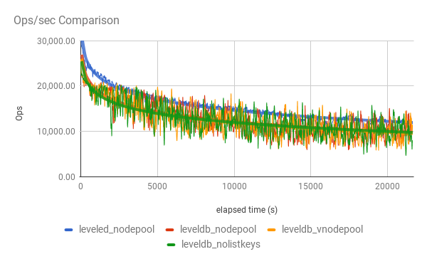
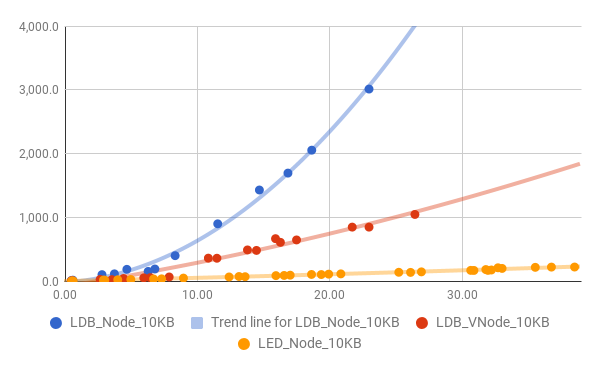

# Anti-Entropy

## Background

In the early history of Riak, there were three levels of protection against loss of data, where loss is caused by either a backend store not receiving data (because it was unavailable), or losing writes (due to a crash, or corruption of previously written data):

- [Read repair](http://docs.basho.com/riak/kv/2.2.3/learn/concepts/replication/#read-repair), whenever an object was read, the finite-state-machine managing the GET, would wait for a response from all vnodes; after replying to the client the FSM would update any vnode which had revealed an out of date version of the object.

- [Hinted handoff](http://docs.basho.com/riak/kv/2.2.3/using/reference/handoff/#types-of-handoff), if a fallback node has taken responsibility for writes to a given vnode due to a temporary ring change in the cluster (e.g. due to a node failure), then when the expected primary returns to service the fallback node should be triggered to handoff any data it has (from this or any previous fallback period) to the expected primary vnode.  Once handoff was complete the vnode would then self-destruct and remove any durable state.  Fallback nodes start vnodes for the same ring partition as the primary vnode.  A fallback node is selected because it owns the next vnode in the ring, but it starts a new vnode to replace the primary vnode, it doesn't store data in the vnode backend which caused it to be considered a fallback (fallback is to a node not to a vnode) - so handoff is not normally required to be selective about the data that is handed off.

- [Key-listing for multi-data-centre replication](http://docs.basho.com/riak/kv/2.2.3/using/reference/v2-multi-datacenter/architecture/#fullsync-replication), for customers with the proprietary Riak Enterprise software there was a mechanism whereby vnode by vnode there would be a fold over all the objects in the vnode, for a replicated bucket, calculating a hash for the object and sending the keys and hashes to a replicated cluster for comparison with the result of its equivalent object fold.  Any variances would then be repaired by streaming those missing updates between the clusters to be re-added across all required vnodes.

There were three primary issues with these mechanisms:

- Some objects may be read very infrequently, and such objects may be lost due to a series of failure or disk-corruption events that occurred between reads and hence without the protection of read repair.

- For large stores per-vnode object folding required for MDC was an expensive operation, and when run in parallel with standard database load could lead to unpredictable response times.

- Some read events do not validate across multiple vnodes, primarily secondary index queries, so an inconsistent index due to a failed write would never be detected by the database.  Secondary index queries were not necessarily eventually consistent, but were potentially never consistent.

To address these weaknesses Active Anti-Entropy (AAE) was introduced to Riak, as a configurable option.  Configuring Active Anti-Entropy would start a new AAE "hashtree" store for every primary vnode in the ring.  The vnode process would, following a successful put, [update this hashtree store process](https://github.com/basho/riak_kv/blob/2.1.7/src/riak_kv_vnode.erl#L2139-L2169) by sending it the updated object after converting it from its binary format.  This would generally happen in via async message passing, but periodically the change would block the vnode to confirm that the AAE process was keeping up.  The hashtree store process would hash the riak object to create a hash for the update, and hash the Key to map it to one of 1024 * 1024 segments - and then in batches update the store with a key of {$t, Partition, Segment, Key}, and a value of the object hash.

From this persisted store a [Merkle tree](https://en.wikipedia.org/wiki/Merkle_tree) is maintained for each Partition.  These Merkle trees can then then be exchanged with another vnode's AAE hashtree store if that vnode is also a primary vnode for that same partition.  Exchanging the Merkle tree would highlight any segments which had a variance - and then it would be possible to iterate over the store segment by segment to discover which keys actually differed.  The objects associated with these keys could then be re-read within the actual vnode stores, so that read repair would correct any entropy that had been indicated by the discrepancy between the hashtree stores.  

The process of maintaining the hashtree is partially deferred to the point of the exchange, and this update process is of a low but not-necessarily non-trivial cost.  the cost is low enough so that these exchanges can occur with reasonable frequency (i.e. many minutes between exchanges) without creating significant background load.  

Infrequently, but regularly, the hashtree store would be cleared and rebuilt from an object fold over the vnode store to ensure that it reflected the actual persisted state in the store.  This rebuild process depends on some cluster-wide lock acquisition and other throttling techniques, as it has to avoid generating false negative results from exchanges scheduled to occur during the rebuild, avoid unexpected conditions on shutdown during the rebuild, avoid excessive concurrency of rebuild operations within the cluster, and avoid flooding the cluster with read-repair events following a rebuild.  Despite precautionary measures within the design, the rebuild process is, when compared to other Riak features, a relatively common trigger for production issues.

Prior to AAE being available there were three primary issues with anti-entropy in Riak, as listed above. The impact on the three primary issues from introducing AAE was:

- Repair was de-coupled from reads, and so unread objects would not have a vastly reduced risk of disappearing following node failure and disk corruption events.

- Exchanges have a predictable and limited impact on cluster load, relative to object folds, if the variance highlighted by the exchange is small.

- Secondary index queries would be made consistent following PUT failure after the next AAE exchange, and those exchanges are regular.  Consistency is maintained by comparison of the actual object, not the index entries within the backed, and so loss of index data due to backend corruption would still not be detected by AAE.

Although this represented an improvement in terms of entropy management, there were still some imperfections with the approach:

- The hash of the object was *not* based on a canonicalised version of the object, so could be inconsistent between trees (https://github.com/basho/riak_kv/issues/1189).

- Converting the object from_binary and sending it to another process (to pass from the `riak_kv_vnode` to the `riak_kv_index_hashtree` has a potentially non-trivial cost for larger objects with significant amounts of metadata (e.g. 2i terms).

- Hashtrees may become mysteriously inconsistent following rebuilds, if the rebuild followed a cluster change operation (e.g. adding/removing a node) - and there would be storms of read actions prompted that would not lead to repairs.

- The anti-entropy mechanism is tightly coupled with the partitioning of the cluster, and so cannot be used between clusters of different ring-sizes so that replication cannot support safe ring-size changes (i.e. we cannot change ring size by starting another cluster with a different size and replicating to that cluster).

- The hashtrees are not externally exposed, and so cannot be used for externally managed replication (e.g. to another database).

- The rebuilds of the hashtree still require the relatively expensive fold_objects operation, and so parallelisation of rebuilds may need to be controlled to prevent an impact on cluster performance.  Measuring the impact is difficult in pre-production load tests due to the scheduled and infrequent nature of AAE rebuilds.

- Improvements to hashtrees require significant devleopment and test for transition, due to the potential for hashtree changes to break many things (e.g. Solr integration, MDC), and also the difficulty in coordinating changes between different dependent systems that independently build state over long periods of time.

## Leveled and AAE

Leveled is primarily designed to be a backend for Riak.  As part of the ongoing community work to build improvements into a new pure open-source release of Riak, some features have been added directly to Leveled to explore some potential enhancements to anti-entropy.  These features are concerned with:

- Allowing for the database state within in a Leveled store or stores to be compared with an other store or stores which should share a portion of that state;

- Allowing for quicker checking that recent changes to one store or stores have also been received by another store or stores that should be receiving the same changes.

The aim is to use these as new backend capabilities, combined with new coverage FSM query behaviour, to allow for new Riak anti-entropy mechanisms with the following features:

- Comparison can be made between clusters with different ring-sizes - comparison is not coupled to partitioning.

- Comparison can use a consistent approach to compare state within and between clusters.

- Comparison does not rely on duplication of database state to a separate anti-entropy database, with further anti-entropy required to manage state variance between the actual stores and anti-entropy stores.

- Comparison of state can be abstracted from Riak specific implementation so that mechanisms to compare between Riak clusters can be re-used to compare between a Riak cluster and another database store.  Coordination with another data store (e.g. Solr) can be controlled by the Riak user not just the Riak developer.

- Comparison can be controlled at a bucket level, so that buckets can be configured to be either specifically whitelisted into the anti-entropy scope, or blacklisted from it - with the option to support different schedules for anti-entropy operations for different buckets when whitelisting is used.

- Through the use of key types allow for flexibility to calculate anti-entropy mechanisms in a way specific to the type of object being stored (e.g. support alternative mechanisms for some CRDT types).

## Merkle Trees

Riak has historically used [Merkle trees](https://en.wikipedia.org/wiki/Merkle_tree) as a way to communicate state efficiently between actors.  Merkle trees have been designed to be cryptographically secure so that they don't leak details of the individual transactions themselves.  This strength is useful in many Merkle Tree use cases, and is part derived from the use of concatenation when calculating branch hashes from leaf hashes:

> A hash tree is a tree of hashes in which the leaves are hashes of data blocks in, for instance, a file or set of files. Nodes further up in the tree are the hashes of their respective children. For example, in the picture hash 0 is the result of hashing the concatenation of hash 0-0 and hash 0-1. That is, hash 0 = hash( hash 0-0 + hash 0-1 ) where + denotes concatenation.

A side effect of the concatenation decision is that trees cannot be calculated incrementally, when elements are not ordered by segment.  To calculate the hash of an individual leaf (or segment), the hashes of all the elements under that leaf must be accumulated first.  In the case of the leaf segments in Riak, the leaf segments are made up of a hash of the concatenation of {Key, Hash} pairs under that leaf:

``hash([{K1, H1}, {K2, H2} .. {Kn, Hn}])``

This requires all of the keys and hashes to be pulled into memory to build the hashtree - unless the tree is being built segment by segment.  The Riak hashtree data store is therefore ordered by segment so that it can be incrementally built.  The segments which have had key changes are tracked, and at exchange time all "dirty segments" are re-scanned in the store segment by segment, so that the hashtree can be rebuilt.  Note though, that this is necessary in the current hashtree implementation even if there was an incrementally buildable Merkle Tree, as there is no read before write into the hashtree to inform the process of what update (if any) to reverse out of the Tree as well as which update to add in.

## Tic-Tac Merkle Trees

Anti-entropy in leveled is supported using the [leveled_tictac](https://github.com/martinsumner/leveled/blob/mas-tictac/src/leveled_tictac.erl) module.  This module uses a less secure form of merkle trees that don't prevent information from leaking out, or make the tree tamper-proof, but allow for the trees to be built incrementally, and trees built incrementally to be merged.  These Merkle trees we're calling Tic-Tac Trees after the [Tic-Tac language](https://en.wikipedia.org/wiki/Tic-tac) to fit in with Bookmaker-based naming conventions of leveled.  The Tic-Tac language has been historically used on racecourses to communicate the state of the market between participants; although the more widespread use of mobile communications means that the use of Tic-Tac is petering out, and rather like Basho employees, there are now only three Tic-Tac practitioners left.

The first change from secure Merkle trees is simply to XOR together hashes to combine them, rather than re-hash a concatenation of keys and hashes.  Combined with the use of trees of fixed sizes, this allows for tree merging to be managed through XOR operations.  So a segment leaf is calculated from:

``hash(K1, H1) XOR hash(K2, H2) XOR ... hash(Kn, Hn)``

The Keys and hashes can now be combined in any order with any grouping.  The use of XOR instead of concatenation is [discouraged in secure Merkle Trees](https://security.stackexchange.com/questions/89847/can-xor-be-used-in-a-merkle-tree-instead-of-concatenation) but is not novel in its use within [trees focused on anti-entropy](http://distributeddatastore.blogspot.co.uk/2013/07/cassandra-using-merkle-trees-to-detect.html).

This enables two things:

- The tree can be built incrementally when scanning across a store not in segment order (i.e. scanning across a store in key order) without needing to hold an state in memory beyond the fixed size of the tree.

- Two trees from stores with non-overlapping key ranges can be merged to reflect the combined state of that store i.e. the trees for each store can be built independently and in parallel and the subsequently merged without needing to build an interim view of the combined state.

It is assumed that the trees will only be transferred securely between trusted actors already permitted to view, store and transfer the real data: so the loss of cryptographic strength of the tree is irrelevant to the overall security of the system.

## Recent and Whole

### Current Riak AAE

Anti-entropy in Riak is a dual-track process:

- there is a capacity to efficiently and rapidly provide an update on overall vnode state that reflects recent additions, by maintaining a separate anti-entropy store in parallel to each primary store;

- there is a capacity to ensure that the anti-entropy view of state represents the state of the whole database, as actually exists on disk, by periodically rebuilding that view from the primary store.

Within the current Riak AAE implementation, tracking recent changes is supported by having a dedicated anti-entropy store organised by segments (an identifier of a leaf of the Merkle tree) so that the Merkle tree can be updated incrementally to reflect recent changes.  When a new update is received an AAE tree update is made following the vnode update, and the segment is marked as requiring an update before completing the next Merkle tree exchange.  

However as the view of the whole state is maintained in a different store to that holding the actual data: there is an entropy problem between the actual store and the AAE store e.g. data could be lost from the real store, and go undetected as it is not lost from the AAE store.  So periodically the AAE store is rebuilt by scanning the whole of the real store.  This rebuild can be an expensive process, and the cost is commonly controlled through performing this task infrequently.  Prior to the end of Basho there were changes pending in riak\_kv's develop branch to better throttle and schedule these updates - through the `riak_kv_sweeper`, so that the store could be built more frequently with safety (and so that the scans necessary to build the store could be multi-purpose).

The AAE store also needs to be partially scanned on a regular basis to update the current view of the Merkle tree, to reflect the segments which have been altered by recent changes.  If a vnode has 100M keys, and there has been 1000 updates since the last merkle tree was updated - then there will need to be o(1000) seeks across subsets of the store returning o(100K) keys in total.  As the store grows, the AAE store can grow to a non-trivial size, and these operations may have an impact on the page-cache and disk busyness within the node.

The AAE store is re-usable for checking consistency between databases, but with the following limitations:

- the two stores need to be partitioned equally, constraining replication to other database technologies, and preventing replication from being used as an approach to re-partitioning (ring re-sizing).

- the AAE store is not split by bucket, and so supporting replication configured per bucket is challenging.  

The AAE process in production system commonly raises false positives (prompts repairs that are unnecessary), sometimes for [known reasons](https://github.com/basho/riak_kv/issues/1189), sometimes for unknown reasons, especially following rebuilds which follow ring changes.  The repair process has [a throttle](http://docs.basho.com/riak/kv/2.2.3/using/cluster-operations/active-anti-entropy/#throttling) to prevent this from impacting a production system, but this commonly needs to be re-tuned based on experience.

### Proposed Leveled AAE

The first stage in considering an alternative approach to anti-entropy, was to question the necessity of having a dedicated AAE database that needs to reflect all key changes in the actual vnode store.  This separate store is currently necessary as the hashtree needs a store sorted by segment ID that make that store easier to scan for rebuilds of the tree, hence avoiding the three main costs with scanning over the primary database:

- the impact on the page cache as all keys and values have to be read from disk, including not-recently used values;

- the overall I/O load (primarily disk-related) of scanning the full database from disk;

- the overall I/O load (primarily network-related) of streaming results from the fold.

The third cost can be addressed by the fold output being an incrementally updatable tree of a fixed size; i.e. if the fold builds a Tic-Tac tree and doesn't stream results (like list keys), and guarantees a fixed size output both from a single partition and following merging across multiple partitions.  

Within Leveled the first two costs are reduced by design due to the separation of Keys and Metadata from the object value, reducing significantly the workload associated with such a scan; especially where values are large.

The [testing of traditional Riak AAE](https://github.com/martinsumner/leveled/blob/master/docs/VOLUME.md#leveled-aae-rebuild-with-journal-check) already undertaken has shown that scanning the database is not necessarily such a big issue in Leveled.  So it does seem potentially feasible to scan the store on a regular basis.  The testing of Leveldb with the `riak_kv_sweeper` feature shows that with the improved throttling more regular scanning is also possible here: testing with `riak_kv_sweeper` managed to achieve 10 x the number of sweeps, with only a 9% drop in throughput.

A hypothesis is proposed that regular scanning of the full store to produce a Tic-Tac tree is certainly feasible in Leveled, but also potentially tolerable in other back-ends.  However, <b>frequent</b> scanning is likely to still be impractical.  If it is not possible to scan the database frequently, if a recent failure event has led to a discrepancy between stores, this will not be detected in a timely manner.  It is therefore suggested that there should be an alternative form of anti-entropy that can be run in addition to scanning, that is lower cost and can be run frequently in support of whole database scanning.  This additional anti-entropy mechanism would focus on the job of verifying that <b>recent</b> changes have been received.  

So there would be two anti-entropy mechanisms, one which can be run frequently (minutes) to check for the receipt of recent changes, and one that can be run regularly but infrequently (hours/days) to check that full database state is consistent.

It is proposed to compare full database state by scanning the actual store, but producing a Tic-Tac Merkle tree as the outcome, one that can be merged across partitions through a coverage query to provide an overall view of the database state.  This view could be compared with different coverage query offsets within the same cluster, and with different replicated clusters.

To provide a check on recent changes it is proposed to add a temporary index within the store, with an entry for each change that is built from a rounded last modified date and the hash of the value, so that the index can be scanned to form a Tic-Tac tree of recent changes.  This assumes that each object has a Last Modified Date that is consistent (for that version) across all points where that particular version is stored, to use as the field name for the index.  The term of the index is based on the segment ID (for the tree) and the hash of the value. This allows for a scan to build a tree of changes for a given range of modified dates, as well as a scan for keys and hashes to be returned for a given segment ID and date range.

As this index only covers recent changes, it will be limited in size, and mainly in-memory, and so it can be scanned frequently in a cost-effective manner to both gather trees for comparison, and discover Keys in segments with variations.

Within the Leveled the index can be made temporary by giving the entry a time-to-live, independent of any object time to live.  So once the change is beyond the timescale in which the operator wishes to check for recent changes, it will naturally be removed from the database (through deletion on the next compaction event that hits the entry in the Ledger).  Therefore in the long-term, there is no need to maintain additional state outside of the primary database stores, in order to manage anti-entropy.  This may also be possible using TTL features in leveldb.

Hence overall this should give:

- A low cost mechanism for checking for the distribution of recent changes.

- A mechanism for infrequently comparing overall state that is naturally consistent with the actual store state, without compromising operational stability of the store.

- No additional long-term overhead (i.e. duplicate key store for anti-entropy).


## Leveled Implementation

### Full Database Anti-Entropy

There are two parts to the full database anti-entropy mechanism:  the Tic-Tac trees implemented in the leveled_tictac modules; and the queries required to build the trees available through the book_returnfolder function.  There are two types of queries supported -

```
{tictactree_obj,
            {Tag, Bucket, StartKey, EndKey, CheckPresence},
            TreeSize,
            PartitionFilter}
```

```
{tictactree_idx,
            {Bucket, IdxField, StartValue, EndValue},
            TreeSize,
            PartitionFilter}
```

The tictactree_obj folder produces a Tic-Tac tree from a fold across the objects (or more precisely the heads of the objects in the Ledger) using the constraints Tag, Bucket, StartKey and EndKey.  CheckPresence can be used to require the folder to confirm if the value is present in the Journal before including it in the tree - this will slow down the fold significantly, but protect from corruption in the Journal not represented in the Ledger.  The partition filter can be used where the store holds data from multiple partitions, and only data form a subset of partitions should be included, with the partition filter being a function on the Bucket and Key to make that decision.

The tictactree_idx folder produces a Tic-Tac tree from a range of an index, and so can be used like tictactree_obj but for checking that an index is consistent between coverage offsets or between databases.

These two folds are tested in the tictac_SUITE test suite in the ``many_put_compare`` and ``index_compare`` tests.

### Near Real-Time Anti-Entropy

The near real-time anti-entropy process can be run in two modes: blacklisting and whitelisting.  In blacklisting mode, specific buckets can be excluded from anti-entropy management, and all buckets not excluded are managed in a single "$all" bucket.  Anti-entropy queries will need to always be requested against the "$all" bucket.  In whitelisting mode, only specific buckets are included in anti-entropy management.  Anti-entropy queries will need to be requested separately for each whitelisted bucket, and may be scheduled differently for each bucket.

The index entry is then of the form:

- Tag: ?IDX_TAG

- Bucket: Bucket

- Field: Last Modified Date (rounded down to a configured unit in minutes)

- Term: Segment ++ "." ++ Hash

- Key : Key

In blacklist mode the Bucket will be $all, and the Key will actually be a {Bucket, Key} pair.

The index entry is given a TTL of a configurable amount (e.g. 1 hour) - and no index entry may be added if the change is already considered to be too far in the past.  The index entry is added to the Ledger in the same transaction as an object value update, and will be re-calculated and re-added out of the Journal under restart conditions where the change has not reached a persisted state in the Ledger prior to the close, for example after a crash.

Querying this anti-entropy index can re-use the ``tictactree_idx`` query feature used for Full Database Anti-Entropy.  

The near real-time entropy index currently has four ct tests:

- `recent_aae_noaae` (confirming loading a store with real-time aae disabled has no impact);

- `recent_aae_allaae` (confirming that a single store loaded with data can be compared with the a store where the same data is spread across three leveled instances - with all buckets covered by anti-entropy);

- `recent_aae_bucketaae` (confirming that a single store loaded with data can be compared with the a store where the same data is spread across three leveled instances - with a single buckets covered by anti-entropy);

- `recent_aae_expiry` (confirming that aae index will expire).

### Clock Drift

The proposed near-real-time anti-entropy mechanism depends on a timestamp, so ultimately some false positives and false negatives are unavoidable - especially if clock drift is large.  The assumption is:

- that this method is never a single dependency for ensuring consistency, it is supported by other mechanisms to further validate, that would detect false negatives.

- that recovery from false positives will be safely implemented, so that a falsely identified discrepancy is validated before a change is made (e.g. read-repair).

Even with this mitigation, the volume of false positives and negatives needs to be controlled, in particular where clock drift is small (i.e. measured in seconds), and hence likely.  If the object has a last modified date set in one place, as with Riak, there is no issue with different actors seeing a different last modified date for the same change.  However, as the index object should expire the risk exists that the store will set an inappropriate expiry time, or even not index the object as it considers the object to be a modification too far in the past.  The Near Real-Time AAE process has the concept of unit minutes, which represents the level of granularity all times will be rounded to.  All expiry times are set with a tolerance equal to the unit minutes, to avoid false positives or negatives when clock drift is small.

## Alternative Approaches

The approach considered for Leveled has been to modify the Merkle trees used to ease their implementation, as well as specifically separating out anti-entropy for recent changes as a different problem to long-term anti-entropy of global state.

[Recent research](http://haslab.uminho.pt/tome/files/global_logical_clocks.pdf) has been released which examines using dotted version vectors at a node level to improve the efficiency of managing key-level consistency, reducing the risks associated with deletes (without permanent tombstones), but also provide an inherently integrated approach to active anti-entropy.

The [Global Logical Clock](https://github.com/ricardobcl/DottedDB) approach does assume that durability is not mutable:

> Nodes have access to durable storage; nodes can crash but
eventually will recover with the content of the durable storage as at the time of
the crash.

It is strongly preferred that our anti-entropy approach can deal with the loss of data that had been persisted to disk (e.g. perhaps through administrative error or disk failure), not just the loss of updates not received.  This doesn't mean that such an approach is invalid as:

- the near real-time approach element of anti-entropy *is* only focused on the loss of updates not received;

- it may be possible to periodically rebuild the state of bitmapped version vectors based on the data found on disk (similarly to the current hashtree rebuild process in Riak AAE).

Some further consideration has been given to using a version of this Global Logical Clock approach to managing near-real-time anti-entropy only.  More understanding of the approach is required to progress though, in particular:

- How to manage comparisons between clusters with different partitioning algorithms (e.g different ring-sizes);

- How to discover key IDs from missing dots where the controlling node for the update has recently failed.

This likely represent gaps in current understanding, rather than flaws in the approach.  The evolution of this research will be tracked with interest.

## Some Notes on Riak implementation

Some notes on re-using this alternative anti-entropy mechanism within Riak:

* There is divergence between Leveled and LevelDB with regards to how async folds are implemented.  Within LevelDB requesting an async fold returns a folder function that will take a snapshot when it is called.  Within Leveled the option exists to take the snapshot before returning the folder function, so that calling the folder function will work on a snapshot of the store taken when the folder was requested.  This difference caused issues with testing with riak_kv_sweeeper, as the scheduling in sweeper meant that folds would be requested, and left on a queue for a long enough to be timed out by the time it was called.  The quick fix for riak_kv_sweeper testing was to make the folder snapshot behaviour in Leveled consistent with LevelDB.  However, the original behaviour opens up some interesting possibilities for AAE implementation in that a coverage set of vnodes could be snapshotted at a point in time, but not all folds need to be run concurrently to make the result consistent to the point in time.  This would allow folds could be directly throttled during the  coverage process to manage the number of folds running on each node at once, without opening up a time-gap between snapshots that would increase the number of false repairs.  

    - It may be possible to make the leveldb behaviour async like leveled.  The fold function contains the setup of the iterator and doing the fold, and perhaps these could be separated such that the iterator would be setup prior to the fold function being returned:

      ```
      fold_keys(Ref, Fun, Acc0, Opts) ->
          {ok, Itr} = iterator(Ref, Opts, keys_only),
          do_fold(Itr, Fun, Acc0, Opts).
      ```
    - Likewise with bitcask, it currently is async with the snapshot effectively inside of the async folder function returned (for bitcask it opens a new bitcask store in read-only mode), and this could be done outside.  This could be moved outside of the async part but, unlike with leveldb and leveled snapshots this is a relatively expensive operation - so this would block the main bitcask process in an unhealthy way.  So finding a simple way of snapshotting prior to the fold and outside of the async process would require more work in Bitcask.

    - riak_core supports vnode_worker_pools (currently only one) and riak_kv sets up a pool for folds.  The potential may also exist to have a node_worker_pool on each node.  It may then be possible to divert snapped async work to this pool (i.e. where the response is {snap, Work, From, NewModState} as opposed to [async](https://github.com/basho/riak_core/blob/2.1.8/src/riak_core_vnode.erl#L358-#L362), the node_worker_pool would be asked to fulfill this work).  The second pool could have a more constrained number of concurrent workers, perhaps just one.  Therefore no more than one vnode on the node would be active doing this sort of work at any one time, and when that work is finished the next vnode in the queue would pick up and commence its fold.

* In Leveled a special fold currently supports the Tic-Tac tree generation for indexes, and one for objects.  It may be better to support this through a offering a more open capability to pass different fold functions and accumulators into index folds.  This could be re-used for "reporting indexes", where we want to count terms of different types rather than return all those terms via an accumulating list e.g. an index may have a bitmap style part, and the function will apply a wildcard mask to the bitmap and count the number of hits against each possible output.  

* The initial intention is to implement the hashtree query functions based around the coverage_fsm behaviour, but with the option to stipulate externally the offset.  So to test for differences between clusters, the user could concurrently query the two clusters for the same offset (or a random offset), whereas to find entropy within a cluster two concurrently run queries could be compared for different offsets.  

* A surprising feature of read repair is that it will read repair to fallback nodes, not just primary nodes.  This means that in read-intensive workloads, write activity may dramatically increase during node failure (as a large proportion of reads will become write events) - increasing the chance of servers falling domino style.  However, in some circumstances the extra duplication can also [increase the chance of data loss](https://github.com/russelldb/russelldb.github.io/blob/master/3.2.kv679-solution.md)!  This also increases greatly the volume of unnecessary data to be handed-off when the primary returns.  Without active anti-entropy, and in the absence of other safety checks like `notfound_ok` being set to false, or `pr` being set to at least 1 - there will be scenarios where this feature may be helpful.  As part of improving active anti-entropy, it may be wise to re-visit the tuning of anti-entropy features that existed prior to AAE, in particular should it be possible to configure read-repair to act on primary nodes only.

## Some notes on the experience of Riak implementation

### Phase 1 - Initial Test of Folds with Core node_worker_pool

As an initial proving stage of implementation, the riak_core_node_worker_pool has been implemented in riak_kv and riak_core, and then the listkeys function has been change so that it can be switched between using the node_worker_pool (new behaviour) and running in parallel using the vnode_worker_pool (old behaviour).

This also required a change to the backends for leveldb and leveled (there was not a quick way of making this change in bitcask), such that they could be changed to use a new ``snap_prefold`` capability.  With snap_prefold configured (and requested by the kv_vnode), the backend will return a folder over a database snapshot which has already been taken.  So rather than returning ``{async, Folder}`` whereby calling ``Folder()`` would make the snapshot then run the fold, this can now return ``{queue, Folder}`` where the snapshot has already been taken so if the calling of ``Folder()`` is deferred due to queueing it will still be approximately consistent to the time the request was initiated.

The following branches are required to provide this feature:

```
git clone -b master https://github.com/martinsumner/leveled.git
git clone -b mas-nodeworkerpool https://github.com/martinsumner/riak_core.git  
git clone -b mas-leveled-corenodeworker https://github.com/martinsumner/riak_kv.git  
git clone -b mas-leveled-2.0.34 https://github.com/martinsumner/eleveldb.git  
```

The purpose of these branches was to do an initial test of how bad the problem of running listkeys is, how does running listkeys compare between leveldb and leveled, and how does the impact change if the node_worker_pool rather than the vnode_worker_pool is used (i.e. with and without the ``snap_prefold`` capability enabled).

This was tested with the following configuration:

- 5-node cluster, i2.2xlarge
- 64-partition ring-size
- 100K GETs : 20K UPDATEs : 1 LIST_KEYS operations ratios
- 6KB fixed object size (smaller object size chosen when compared to previous tests to try and relative importance of write amplification in leveldb)
- 400M key-space (pareto distribution)

This initial test showed that there was a minimal impact on throughput with running these listkeys operations leveldb when having ``snap_prefold`` either disabled or enabled.  All three leveldb tests (without listkeys, with listkeys and snap_prefold, with listkeys and without snap_prefold) achieved an overall throughput within the margin of error of cloud testing.



For the 6-hour test the total throughput achieved was:

- leveldb with no listkeys - 272.4M
- leveldb with listkeys vnode_pool - 270.1M (- 0.85%)
- leveldb with listkeys node_pool - 278.0M (+ 2.04%)
- leveled with listkeys node_pool - 333.0M (+ 22.23%)

Of note is the escalating response times of the fold as the size of the database increased.  The nature of the cluster would mean that with unconstrained hardware resource the node_worker_pool should take 5 x longer than the vnode_worker_pool - but within the test it was generally less than 3 times longer.  However, this was 3 times longer than a large time which increased with database size in a non-linear fashion.

With leveled there was a strongly favourable comparison, with both improved response times, and less dramatic rises in those times as the database grew.



Even when using the (constrained) node_worker_pool the leveled implementation runs list_keys jobs at a rate of 155K keys per second.  By contrast leveldb runs at 45K keys per second with the vnode_worker_pool and just 16K keys per second when throttled by using the node_worker_pool.

These rates change with object size with leveldb, but not with leveled.  so when testing with object sizes of 10KB, rates drop to 27K keys per second for the same test with leveldb using the vnode_worker_pool.  However, rates are unchanged for leveled, as the operation in leveled is independent of object size (as object values do not need to be scanned).

The intention is though, not to use list_keys operations in AAE - but instead to dynamically produce TicTac Trees either by folding objects (or heads with leveled) or folding over specialist indexes.  More relevant tests will follow in the next phase.

### Phase 2

tbc
