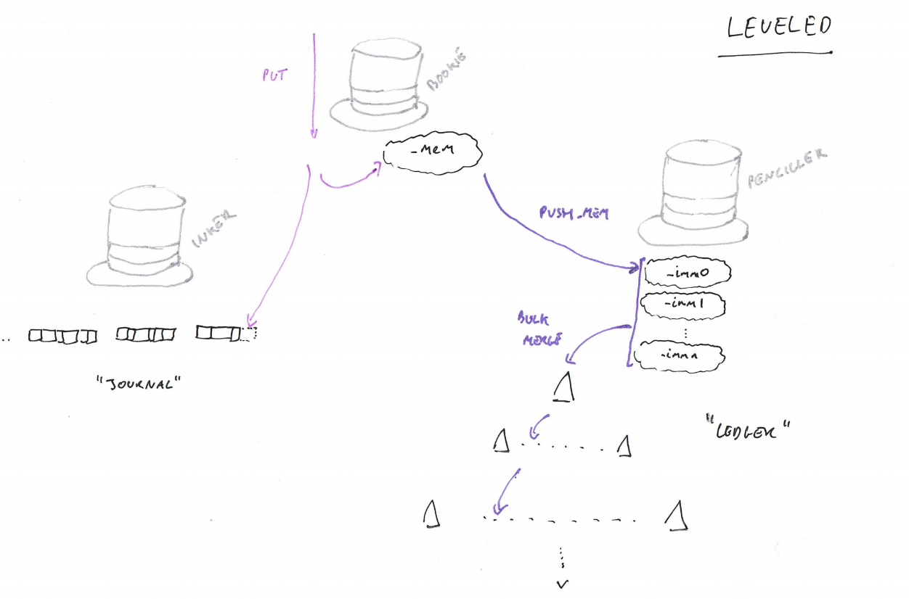
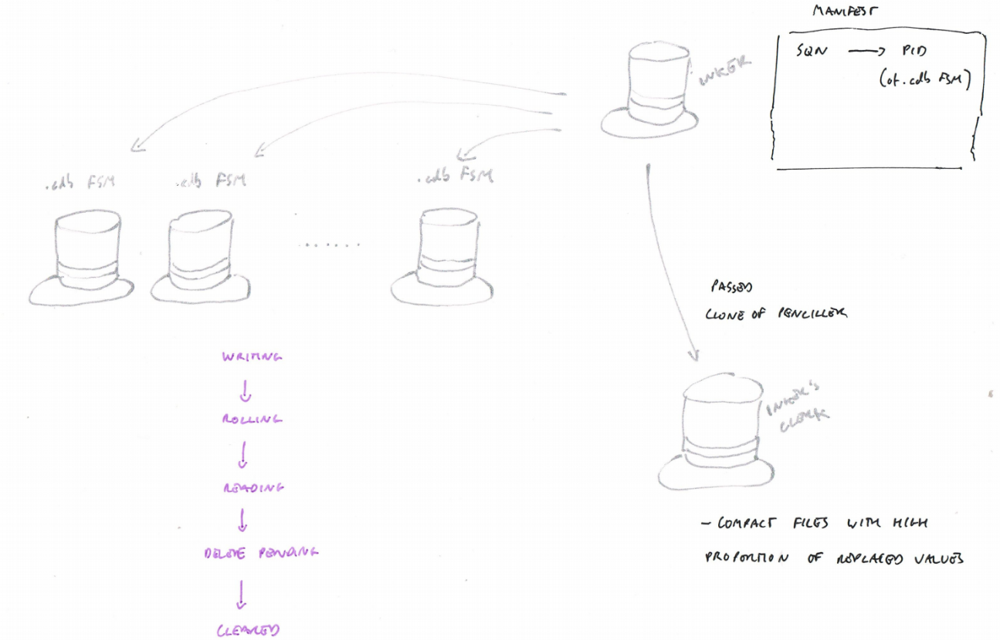
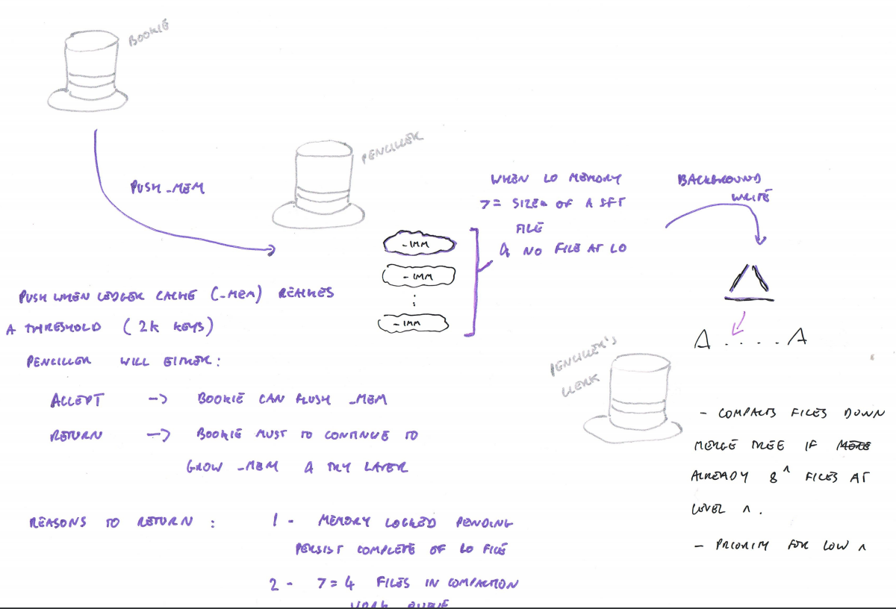

## Design

The store is written in Erlang using the actor model, the primary actors being:

- A Bookie

- An Inker

- A Penciller

- Worker Clerks

- File Clerks

### The Bookie

The Bookie provides the public interface of the store, liaising with the Inker and the Penciller to resolve requests to put new objects, and fetch those objects.  The Bookie keeps a copy of key changes and object metadata associated with recent modifications, but otherwise has no direct access to state within the store.  The Bookie can replicate the Penciller and the Inker to provide clones of the store.  These clones can be used for querying across the store at a given snapshot.

### The Inker

The Inker is responsible for keeping the Journal of all changes which have been made to the store, with new writes being append to the end of the latest journal file.  The Journal is an ordered log of activity by sequence number.  

Changes to the store should be acknowledged if and only if they have been persisted to the Journal.  The Inker can find a value in the Journal through a manifest which provides a map between sequence numbers and Journal files.  The Inker can only efficiently find a value in the store if the sequence number is known.

The Inker can also scan the Journal from a particular sequence number, for example to recover in-memory state within the store following a shutdown.

### The Penciller

The Penciller is responsible for maintaining a Ledger of Keys, Index entries and Metadata (including the sequence number) that represent a near-real-time view of the contents of the store.  The Ledger is a merge tree ordered into Levels of exponentially increasing size, with each level being ordered across files and within files by Key.  Get requests are handled by checking each level in turn - from the top (Level 0), to the basement (up to Level 8).  The first match for a given key is the returned answer.

Changes ripple down the levels in batches and require frequent rewriting of files, in particular at higher levels.  As the Ledger does not contain the full object values, this write amplification associated with the flow down the levels is limited to the size of the key and metadata.

The Penciller keeps an in-memory view of new changes that have yet to be persisted in the Ledger, and at startup can request the Inker to replay any missing changes by scanning the Journal.

### Worker Clerks

Both the Inker and the Penciller must undertake compaction work.  The Inker must garbage collect replaced or deleted objects form the Journal.  The Penciller must merge files down the tree to free-up capacity for new writes at the top of the Ledger.  

Both the Penciller and the Inker each make use of their own dedicated clerk for completing this work.  The Clerk will add all new files necessary to represent the new view of that part of the store, and then update the Inker/Penciller with the new manifest that represents that view.  Once the update has been acknowledged, any removed files can be marked as delete_pending, and they will poll the Inker (if a Journal file) or Penciller (if a Ledger file) for it to confirm that no clones of the system still depend on the old snapshot of the store to be maintained.

The Penciller's clerk work to compact the Ledger is effectively continuous, it will regularly poll the Penciller for compaction work, and do work whenever work is necessary.  The Inker's clerk compaction responsibility is expected to be scheduled.  The Inker's Clerk will need to determine if compaction work is necessary when scheduled, and it does this by asking each CDB file for a random sample of keys and object sizes, and the file is the scored by the Clerk for compaction based on the indication from the sample of the likely proportion of space that will be recovered.  The Inker's Clerk will compact only the most rewarding 'run' of journal files, if and only if the most rewarding run surpasses a threshold score.

### File Clerks

Every file within the store has its own dedicated process (modelled as a finite state machine).  Files are never created or accessed by the Inker or the Penciller, interactions with the files are managed through messages sent to the File Clerk processes which own the files.

The File Clerks themselves are ignorant to their context within the store.  For example a file in the Ledger does not know what level of the Tree it resides in.  The state of the store is represented by the Manifest which maintains a picture of the store, and contains the process IDs of the file clerks which represent the files.

Cloning of the store does not require any file-system level activity - a clone simply needs to know the manifest so that it can independently make requests of the File Clerk processes, and register itself with the Inker/Penciller so that those files are not deleted whilst the clone is active.

The Journal files use a constant database format almost exactly replicating the CDB format originally designed by DJ Bernstein.  The Ledger files use a bespoke format with is based on Google's SST format.

File clerks spend a short initial portion of their life in a writable state.  Once they have left a writing state, they will for the remainder of their life-cycle, be in an immutable read-only state.

## Clones

Both the Penciller and the Inker can be cloned, to provide a snapshot of the database at a point in time. A long running process may then use this clone to query the database concurrently to other database actions.  Clones are used for Journal compaction, but also for scanning queries in the penciller (for example to support 2i queries or hashtree rebuilds in Riak).

The snapshot process is simple.  The necessary loop-state is requested from the real worker, in particular the manifest and any immutable in-memory caches, and a new gen_server worker is started with the loop state.  The clone registers itself as a snapshot with the real worker, with a timeout that will allow the snapshot to expire if the clone silently terminates.  The clone will then perform its work, making requests to the file workers referred to in the manifest.  Once the work is complete the clone should remove itself from the snapshot register in the real worker before closing.

The snapshot register is used by the real worker when file workers are placed in the delete_pending state. File processes enter this state when they have been replaced in the current manifest, but access may still be needed by a cloned process using an older version of the manifest. The file process should poll the Penciller/Inker in this state to check if deletion can be completed, and the Penciller/Inker should check the register of snapshots to confirm that no active snapshot has a potential dependency on the file before responding to proceed with deletion.

Managing the system in this way requires that ETS tables are used sparingly for holding in-memory state, and immutable and hence shareable objects are used instead.  The exception to the rule is the small in-memory state of recent additions kept by the Bookie - which must be exported to a list on every snapshot request.

## Types

Objects in LevelEd all have a type (or tag).  The tag determines how the object will be compacted in both the Ledger and Journal, and what conversions are applied when fetching the object or when splitting the object metadata to convert from the Inker to the Journal.

Three types are initially supported:

- o - standard object

- o_rkv - riak object

- i - index term

All Ledger Keys created for any type must be 4-tuples starting with the tag.  Abstraction with regards to types is currently imperfect, but the expectation is that these types will make support for application specific behaviours easier to achieve, such as behaviours which maybe required to support different [CRDTs](https://en.wikipedia.org/wiki/Conflict-free_replicated_data_type).

## GET/PUT Paths

The PUT path for new objects and object changes depends on the Bookie interacting with the Inker to ensure that the change has been persisted with the Journal, the Ledger is updated in batches after the PUT has been completed.

The [HEAD path](PATHS.md) needs the Bookie to look in his cache of recent Ledger changes, and if the change is not present consult with the Penciller.

The GET path follows the HEAD path, but once the sequence number has been determined through the response from the Ledger the object itself is fetched from the journal via the Inker.

All other queries (folds over indexes, keys and objects) are managed by cloning either the Penciller, or the Penciller and the Inker.

## Startup

On startup the Bookie will start, and first prompt the Inker to startup.  the Inker will load the manifest and attempt to start a process for each file in the manifest, and then update the manifest with those process IDs.  The Inker will also look on disk for any CDB files more recent than the manifest, and will open those at the head of the manifest.  Once Inker startup is complete, the Bookie will prompt the Penciller to startup.

The Penciller will, as with the Inker, open the manifest and then start a process for each file in the manifest to open those files.  The Penciller will also look for a persisted level-zero file which was more recent than the current manifest and open a process for this too.  As part of this process the Penciller determines the highest sequence number that has been seen in the persisted Ledger.  Once the highest sequence number has determined the Penciller will request a reload from that sequence number.

To complete the reload request, the Inker will scan all the Keys/Values in the Journal from that sequence number (in batches), converting the Keys and Values into the necessary Ledger changes, and loading those changes into the Ledger via the Penciller.

Once the Ledger is up-to-date with the very latest changes in the Journal, the Bookie signals that startup is complete and it is ready to receive load.

## Recovery

Theoretically, the entire Ledger can be restored from the Journal, if the Ledger were erased and then the Bookie was started as normal.  This was intended as a potential simplified backup solution, as this would require only the slowly mutating Journal to be backed up, and so would be suited to an incremental delta-based backup strategy and restoring to points in time.  There are some potential issues with this:

- It is not clear how long scanning over the Journal would take with an empty ledger, and it would certainly be too long for the standard Riak vnode start timeout.

- Some changes build over history, and so would be lost if earlier changes are lost due to compaction of out-of-date values (e.g. 2i index changes in Riak).

- Journal compaction becomes more complicated if it is necessary to recover in a scenario where the head of the Journal has been corrupted (so if we have B.0, B.1 and B.2 as three versions of the object, if B.2 is lost due to corruption and B.1 is compacted then B.0 will be resurrected on recovery - so post compaction there is no point in time recovery possible).

Three potential recovery strategies are supported to provide some flexibility for dealing with this:

- recovr - if a value is out of date at the time of compaction, remove it.  This strategy assumes anomalies can be recovered by a global anti-entropy strategy, or that the persisted part of the Ledger is never lost (the Inker's Clerk will never compact a value received after the highest persisted sequence number in the Ledger).

- retain - on compaction KeyDeltas are retained in the Journal, only values are removed.

- recalc (not yet implemented) - the compaction rules assume that on recovery the key changes will be recalculated by comparing the change with the current database state. In recovery the key changes will be recalculated by comparing the change with the current database state.

## Head only

Leveled can be started in `head_only` mode.  This is a special mode which dispenses with the long-term role of the Journal in retaining data.  This is a mode to be used in *special circumstances* when values are small, and Key/Value pairs are added in batches.

In `head_only` mode, batches of keys and values are stored first in the Journal, however once the last element received by the Journal file has been persisted into the Ledger, the Journal file can be deleted.  The values are never returned from
Journal except during startup to recover the in-memory part of the Ledger (the Bookie and Penciller's memory).

There are two ways in which `head_only` mode can be enabled - `with_lookup` and `no_lookup`.  In `with_lookup` mode the an individual value can be fetched from Leveled using a HEAD request.  In `no_lookup`  mode, HEAD requests are not supported - values can only be returned using `fold_heads`.  The `no_lookup` mode is marginally more efficient in terms of CPU usage when under write pressure (it avoids generating key hashes and hash-based lookup indexes within the Penciller).

The `head_only` mode was created so that it could be used as an AAE store in Riak - where values may simply be a version vector or a hash, and retention of data is not critical (it is not the primary store of real user's data).  Leveled is not optimised for supporting small values, the `head_only` mode improves on this when supporting small values.  However, the intention is that Leveled should remain for the long-term an LSM tree designed for scenarios with larger values.  Features, testing and support for `head_only` modes will be limited compared to support for Leveled running in its standard mode of operation.  For use cases where there is a need for `head_only` behaviour in the primary data store - then an alternative store would be a safer choice.

There is no ability to mix `head_only` behaviour with standard behaviour.  there is no expected behaviour when switching databases between different `head_only` modes, and data loss is highly likely.
