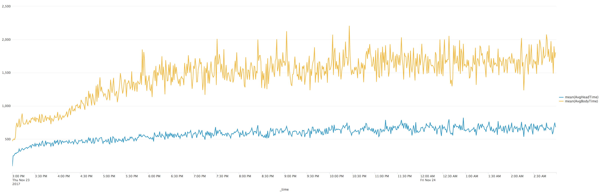
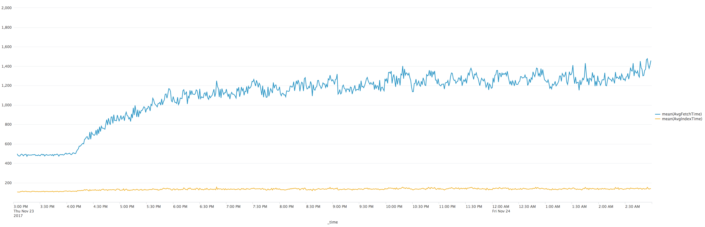
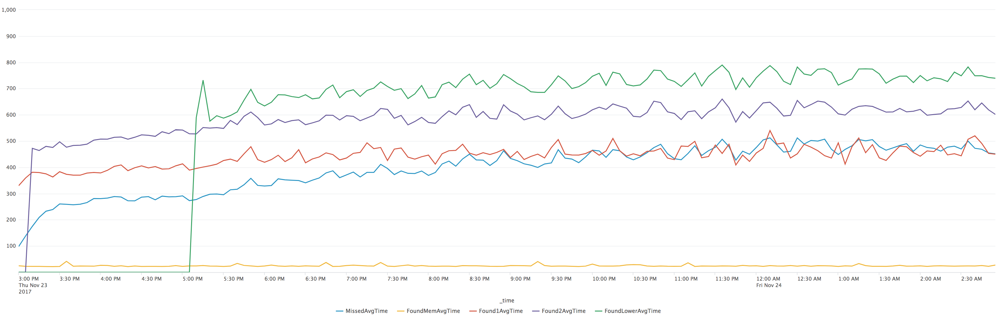
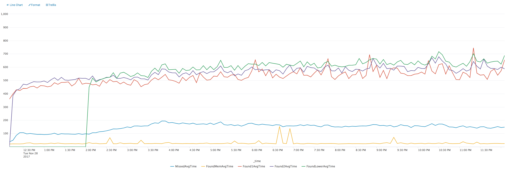
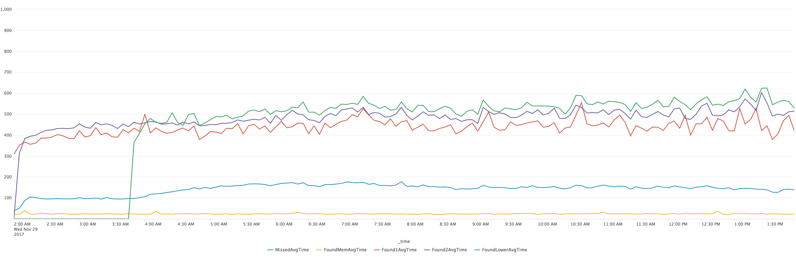
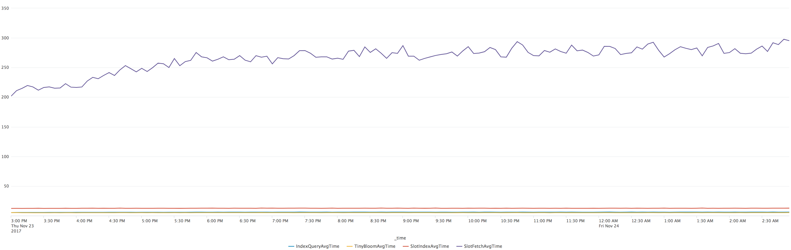
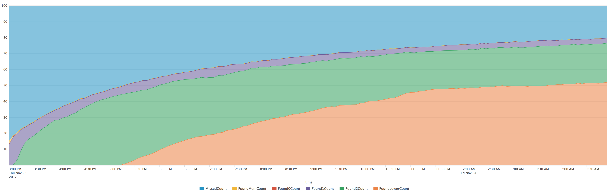
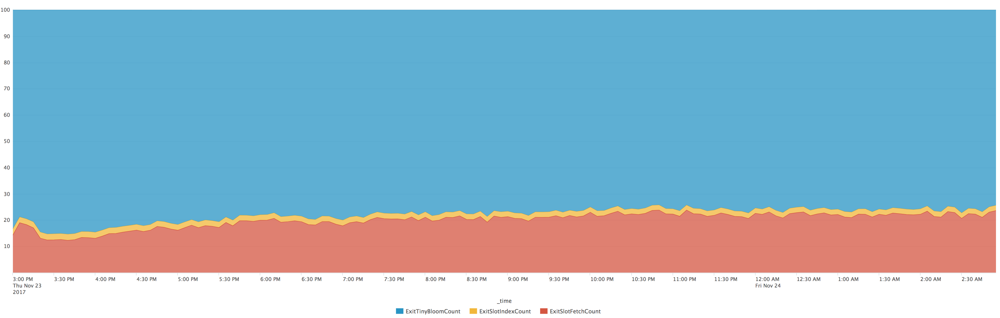

# Breakdown of Latency

In November 2017 a number of metrics have been added to Leveled to help understand where time is spent in different operations.  This is intended firstly to help on an ongoing basis from an operational monitoring perspective, but also isolate areas for potential improvement.

The method of monitoring is focused on periodic sampling and logging.  Various Leveled processes have timing dictionaries on their Loop State, and periodically (after a random number of operations without sampling) these processes will capture the timings for a sample of 100 requests - and then log out those timings.  In this case the logs have been captured via Splunk for tracking.

These logs have been captured in a 12-hour test based on this [basho_bench configuration](https://github.com/martinsumner/basho_bench/blob/mas-nhsload/examples/riakc_nhs.config).  The test was run on a 5-node EC2 cluster using i2.2xlarge nodes (which have a pair of solid state drives configured to be mirrored).

## Get Time

This chart shows for objects where a value was fetched (i.e. the object was present, and a GET rather than Head request was received), the majority of time is spent fetching the Body of the request not the Head.

Timings are in microseconds, and are taken from within the backend.  The AvgHeadTime is a measurement of how long it took the Penciller to return a response to the Head request, and the AvgBodyTime is a measurement of how long it tool the Inker to return the body of the object using the SQN extracted from the Head.

For the first hour of the test the total volume of data within the store is smaller than the available space for the page cache.  From an hour after the start of the test the time to fetch the body increases as the proportion of fetches which are taken from disk and not cache increases.  The stable Head times indicates that fadvise has been effective and Head requests continue to be served from page-cache backed spaces.

Within the CDB file, the fetch time is broken down as follows:

As can be seen here nearly all the time is consumed in fetching the data from disk (using file pread - the AvgFetchTime) as opposed to looking up the pointer (the AvgIndexTime).  The AvgIndexTime seems surprisingly high - but is not significant in terms of the overall time spent servicing requests, especially as it is expected that GET requests should be relatively rare in comparison to Head requests.

This test was run after [the improvements made](https://github.com/martinsumner/leveled/pull/110/commits/52c7a023a1ec165ca0641da5db11f071494177b1) to the index search efficiency, which reduced the AvgIndexTime by o(100) microseconds.

## Put Time

The Put time measurement chart compares the time taken by the Inker to persist the object (note this is a persist to write cache, as these tests do not currently use a sync to flush the cache to disk), with the time taken to make the changes to the in-memory Ledger Cache.  The in-memory Ledger Cache is largely irrelevant, and the Inker time seems aligned with the in-memory CDB get time.  Note that the InkTime includes the compression time for the object as well as the write to the file buffer.

  

## Head Time

The time for Head requests is broken down in two ways: the time based on the level of the merge tree from which it was fetched; the timings within the SST file processes themselves.

The timings for the merge tree are surprisingly high for missing entries (which largely should be covered by bloom filter checks), and there is a surprisingly high gap between the timings for different levels (again given the expected speed of the bloom checks).

This has been improved, first by changing the bloom filter and passing the bloom so that it can be accessed directly without a message pass from the penciller:

A second improvement was to include a small (32) cache of recently fetched keys in each SST process to be checked before the expensive slot_fetch:

Within the SST file, the timings are broken down between index_query (the time taken to find the slot in the tree), tiny_bloom (the time taken to check against the bloom filter for that slot), slot_index (the time taken to look up the position in the slot - which may also double as a bloom filter to determine non_presence) and slot_fetch (the time taken to fetch the block from disk and perform binary_to_term and then walk to the position).

These timings are dominated by the slot_fetch.  Multiple attempts have been made to optimise this slot_fetch - but all improvements have compromised the CPU load at merge time.

For this test we can also see from the metrics the proportion of Head requests which are found, and at what level in the merge tree they are found:

This can also be broken down for each individual SST file request (note that most SST file requests should not find a slot due to the multiple levels).

80% of file requests exit after the bloom check.  Very few false positives are discovered after the bloom check in the slot_index check, so 20% of fetch requests to files result in a slot_fetch.

## Merge Time
