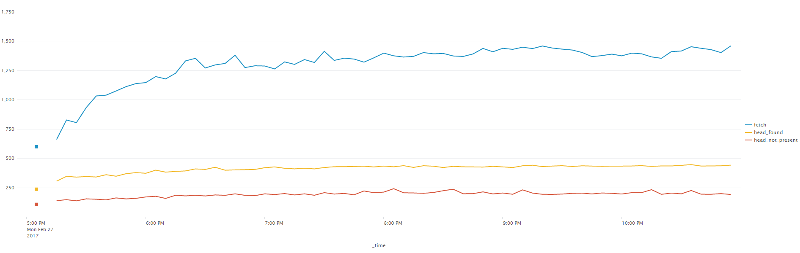
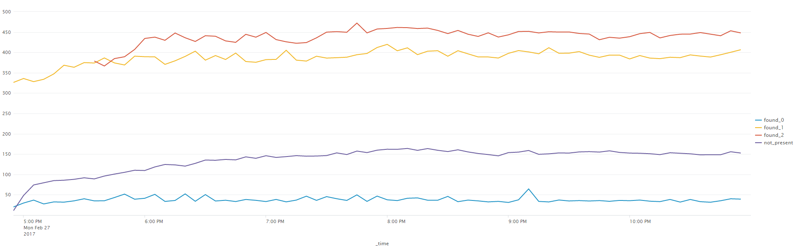

# HEAD Path

To fulfil a HEAD request, the request needs to take the following path:

- Check the Bookie's Ledger Cache, if not found 
- Forward to the Penciller, and check the in-memory Level 0, and if not found
- Check each persisted Level of the merge tree, and if not found
- Return not_found

## TLDR

There is a lot of activity involved in the HEAD path - but most of the activity is very quick and has minimal impact.  

The biggest chunk of effort by far, spending about two-thirds of the CPU time is when a value is found within a SST file's block - and the block needs to be de-serialised (using binary_to_term), and the block (which is a 32 element list of Keys/Metadata) needs to be walked to the nth element to return the Key/Value.  This process takes around 300 microseconds in real world tests, but only 53 microseconds in local benchmark testing (possibly due to CPU cache effects, or perhaps the cost of the file:pread from the page cache).

Each of these steps is now described in more detail.

## The Bookie's Ledger Cache

The Bookie's Ledger Cache is formed from two parts:

- An ets-table configured as an ordered_set
- An index using sequences of hashes in an array (which isn't used in this check)

The index is an array with 256 slots.  Every key that is added to the ledger is hashed using a hash function in leveled_codec - this will either return an integer, or the atom no_lookup.  The atom no_lookup indicates that the key will never need to be looked up directly (it will only be used in range scans), and so there is no need to add the hash for this key to any index or bloom filter.

If the hashing of the key returns an integer, this is split into a 1 byte slot part and a 3-byte hash part.  The slot is used to lookup the index within the array, looking up this index returns a binary under that index of the array, and the hash is appended to that binary (to be precise a 1:1/bitstring then the last 23 bits of the hash).

The index is not used as part of the HEAD process in the Bookie.  Instead the Bookie does an ets:lookup (which is assumed  to be as fast for detecting non presence as checking the hash against the index).  If the Key is present in the ets ordered_set (the ledger cache), then the Key and value (which is actually just metadata) is returned, and this is used to form the HEAD response.  No further lookup action is required.

If the lookup does not return an entry, then the Bookie must request that the Penciller try and answer the request.  To assist with this lookup the Bookie will first calculate the hash (so that the hash is not required to be recalculated at each stage of the Penciller lookup).

## Penciller - check in-memory Level Zero

The Penciller on receiving a request to lookup a Key (with hash), needs to check first in its in-memory view of level-zero.  Level zero is formed of a:

- a list of trees, with each tree being the output of an export of a Ledger Cache (it is exported using ets:tab2list, and then converted to a tree using leveled_tree:from_orderedset).  
- an index of hashes, which is an array that has accumulated the index arrays formed within the Bookie's Ledger cache.

The index of hashes is used to find which of the trees in the list of trees that the Key may be present in.  The hash is converted into a slot and lookup hash part, and the binary is pulled from the entry in the array that aligns with the slot.

The binary is walked, if the first bit of any chunk of the binary is a 1, then the next 23 bits represent a hash that has been added to the index.  If that hash matches the hash of the Key there is a potential match for the tree in that 'position'.  If the first bit is a zero, then the next 7 bits are the position, the position in the list of trees for the tree whose hash entries follow.  Walking the binary should return a list of positions of trees where the Key may be found.

Based on the position list, the Penciller now needs to look for the Key in each of the trees referred to in the position list.  Normally, this would expect to have a low false positive count - so should be either 0 or 1 trees, although it could be more.

The tree lookups themselves are dependent on the implementation chosen within leveled_tree.  All the implementations have roughly equivalent performance characteristics, and the implementations are designed to:

- be rapidly built from a sorted list;
- support efficient lookup of keys that are present;
- support efficient lookups to help build range queries;
- allow for rapid flattening to list.

The levelzero cache normally has between 0 and 20 trees, but can have more, and each tree will normally have about 2000 key entries.

If the key is not present in levelzero, the Penciller must check the persisted merge tree for the result.

The implementation of the levelzero memory is in the leveled_pmem module.

## Penciller - check Merge Tree

To check the merge tree, at each level it is necessary to check the manifest to find a file at the level which may be in range for the lookup.  Once the manifest returns a file, the file process is itself called to check for presence of the Key.  If the Key is not found, the next level should be checked until the bottom of the merge tree is hit, and not_found can be safely assumed. 

The manifest at the top two levels is a simple list, but a leveled_tree implementation is used at lower levels.  The manifest is normally up to 8 ^ n files at level n.  The files are ordered by key, so only one file may possibly contain each key.

The lookup process within a file goes through the following stages:

- lookup the sst_slot within the file that the key may be present in by checking a tree containing the first key in every sst_slot (there are normally 256 slots of 128 keys each in the file), and if a sst_slot is a candidate
- Check for possible presence in a bloom filter for the sst_slot, if result is maybe present then
- lookup the block within the sst_slot (there are 4 blocks in each sst_slot), and the position in the block using the sst_slot index, and if blocks and positions are returned
- read the blocks, convert from binary_to_term, and call lists:nth to check the Key in each potential position.

The tree to lookup the sst_slot is an implementation from leveled_tree.  The bloom to quick-check the sst_slot is an implementation of leveled_tinybloom.  The sst_slot implementation based on indexed blocks is within leveled_sst and is described as follows:

One of the most critical considerations in the sst_slot index implementation has been the cost of the binary_to_term and term_to_binary calls for different sizes of slots and different data types.  Microbenchmarking indicated that flat lists were the fastest.  However, the lists need scanning at query time - and so give longer lookups.  Bigger slots did better at term_to_binary time.  However binary_to_term is an often repeated task, and this is better with smaller slots.  

The outcome has been to divide the slot into four small blocks to minimise  the binary_to_term time.  A binary index is provided for the slot for all  Keys that are directly fetchable (i.e. standard keys not index keys).

The division and use of a list saves about 100 microseconds per fetch when compared to using a 128-member gb:tree.  The binary index is cacheable and doubles as a not_present filter, as it is based on a 17-bit hash (so 0.0039 fpr).

## Performance stats

The following performance charts sees the timings for the different parts of a GET broken down over the course of a 6 hour Riak test:

The head request takes around 200 to 250 microseconds on average if the value is not present, and 400 to 450 microseconds if it is found.  However, the time to find it depends very much on what level it is found:

Finding in level zero takes less than 50 microseconds, level 1 takes 400 microseconds, and level 2 takes 450 microseconds.  These timings are recorded by the Penciller, whereas the previous timings are recorded by the Bookie (so include the ordered_set lookup and message overhead as well as the Penciller timings).

Looking at the timings within a SST file.  Request timings from the perspective of the SST file processes are:

- Not present after slot lookup and tiny_bloom check - 9 microseconds
- Not present after slot lookup and tiny_bloom check and block_index check - 20 microseconds
- Found after all of the above and fetching/de-serialisation of the block - 300 microseconds

Note that the fetching/de-serialising is about 6 times slower real-world tests when compared to direct local benchmark tests - the difference is assumed to be the cache advantages gained from repeatedly testing the same sst_slot when micro-benchmarking, or perhaps the cost of the file:pread from the page_cache (as it should almost always be in the page cache).
