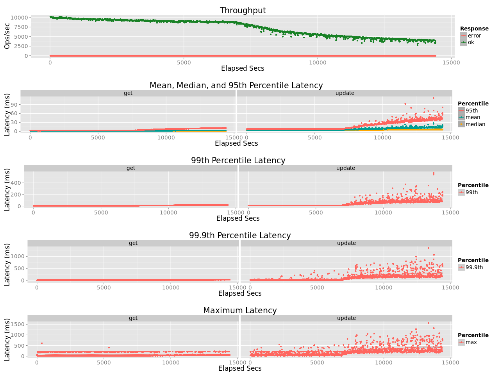

# Volume Testing

## Parallel Node Testing

Initial volume tests have been [based on standard basho_bench eleveldb test](../test/volume/single_node/examples) to run multiple stores in parallel on the same node and and subjecting them to concurrent pressure. 

This showed a [relative positive performance for leveled](VOLUME_PRERIAK.md) for both population and load. This also showed that although the LevelEd throughput was relatively stable it was still subject to fluctuations related to CPU constraints.  Prior to moving on to full Riak testing, a number of changes where then made to LevelEd to reduce the CPU load in particular during merge events.

## Riak Cluster Test - 1

The First test on a Riak Cluster has been based on the following configuration:

- A 5 node cluster
- Using i2.2xlarge EC2 nodes with mirrored SSD drives (for data partition only)
- noop scheduler, transparent huge pages disabled, ext4 partition
- A 64 vnode ring-size
- 45 concurrent basho_bench threads (basho_bench run on separate disks) running at max
- AAE set to passive
- sync writes enabled (on both backends)
- An object size of 8KB
- A pareto distribution of requests with a keyspace of 50M keys
- 5 GETs for each UPDATE
- 4 hour test run

This test showed a <b>73.9%</b> improvement in throughput when using LevelEd, but more importantly a huge improvement in variance in tail latency.  Through the course of the test the average of the maximum response times (in each 10s period) were

leveled GET mean(max)           | eleveldb GET mean(max)
:-------------------------:|:-------------------------:
21.7ms | 410.2ms

leveled PUT mean(max)           | eleveldb PUT mean(max)
:-------------------------:|:-------------------------:
101.5ms | 2,301.6ms

Tail latency under load is around in leveled is less than 5% of the comparable value in eleveldb (note there is a significant difference in the y-axis scale between the latency charts on these graphs).

leveled Results           |  eleveldb Results
:-------------------------:|:-------------------------:
  |  

### Lies, damned lies etc

To a certain extent this should not be too unexpected - leveled is design to reduce write amplification, without write amplification the persistent write load gives leveled an advantage.  The frequent periods of poor performance in leveldb appear to be coordinated with periods of very high await times on nodes during merge jobs, which may involve up to o(1GB) of write activity.

Also the 5:1 ratio of GET:UPDATE is not quite that as:

- each UPDATE requires an external Riak GET (as well as the internal GETs);

- the empty nature of the database at the test start means that there are no actual value fetches initially (just not-present response) and only 50% of fetches get a value by the end of the test (much less for leveldb as there is less volume PUT during the test).

When testing on a single node cluster (with a smaller ring size, and a smaller keyspace) the relative benefit of leveled appears to be much smaller.  One big difference between the single node and multi-node testing undertaken is that between the tests the disk was switched from using a single drive to using a mirrored pair.  It is suspected that the amplified improvement between single-node test and multi-node tests is related in-part to the cost of software-based mirroring exaggerating write contention to disk.

Leveldb achieved more work in a sense during the test, as the test was run outside of the compaction window for leveled - so the on-disk size of the leveled store was higher as no replaced values had been compacted.  Test 6 below will examine the impact of the compaction window on throughput.  

On the flip side, it could be argued that the 73% difference under-estimates the difference in that the greater volume achieved meant that by the back-end of the test more GETs were requiring fetches in leveled when compared with leveldb.  Because of this, by the last ten minutes of the test, the throughput advantage had been reduced to <b>55.4%</b>.

## Riak Cluster Test - 2

An identical test was run as above, but with d2.2xlarge instances, so that performance on spinning disks could be tested for comparison.  This however tanked with sync_on_write enabled regardless if this was tested with leveled or leveldb - with just 1,000 transactions per second supported.

Although append_only writes are being used, almost every write still requires a disk head movement even if the server had all reads handled by in-memory cache (as there are normally more vnodes on the server than there are disk heads).  It is clear that without a Flash-Backed Write Cache, spinning disks are unusable as the sole storage mechanism.

Also tested was d2.2zlarge clusters, but without sync_on_write.  Results were:

leveled Results           |  eleveldb Results
:-------------------------:|:-------------------------:
  |  

This test showed a <b>26.7%</b> improvement in throughput when using LevelEd.  The improvement in tail latency in this test had leveled at about <b>25%</b> of the tail latency of leveldb.

## Riak Cluster Test - 3

to be completed ..

Testing with optimised GET FSM (which checks HEAD requests from r nodes, and only GET request from one node if no sibling resolution required)

## Riak Cluster Test - 4

to be completed ..

Testing with optimised PUT FSM (switching from GET before PUT to HEAD before PUT)

## Riak Cluster Test - 5

to be completed ..

Testing with changed hashtree logic in Riak so key/clock scan is effective

## Riak Cluster Test - 6

to be completed ..

Testing during a journal compaction window

## Riak Cluster Test - 7

to be completed ..

Testing for load including 2i queries

