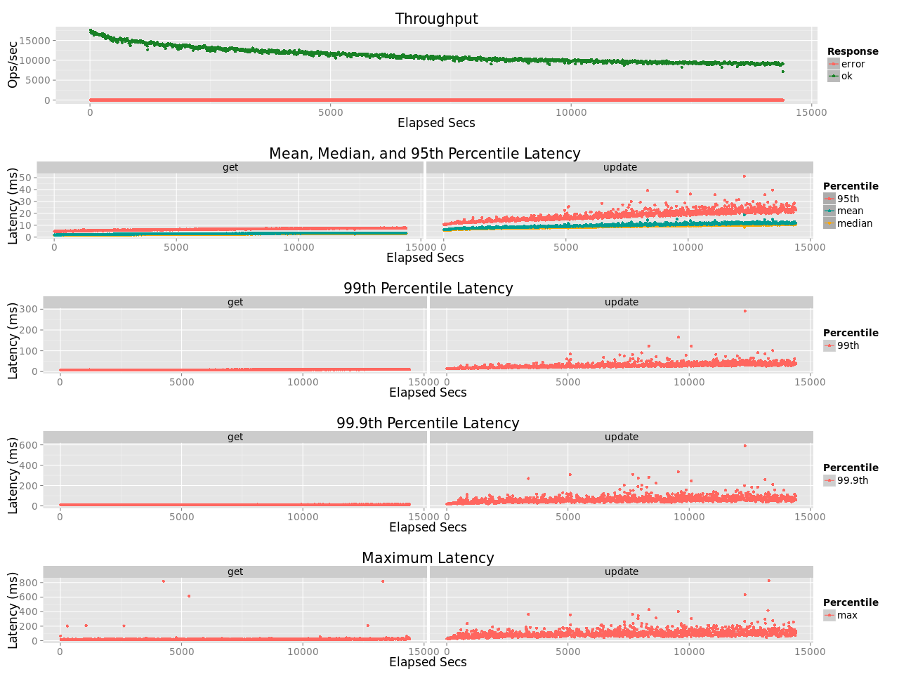
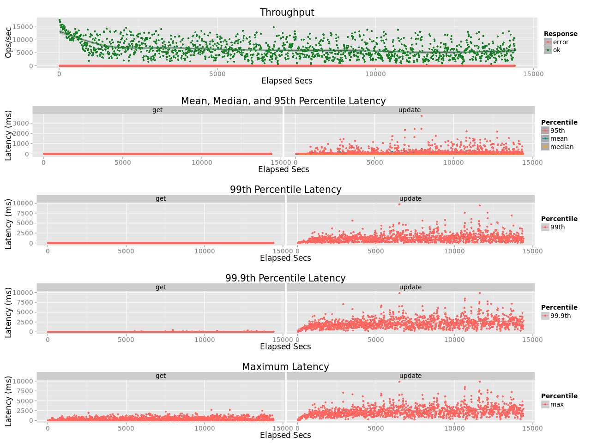

# Volume Testing

## Parallel Node Testing

Initial volume tests have been [based on standard basho_bench eleveldb test](../test/volume/single_node/examples) to run multiple stores in parallel on the same node and and subjecting them to concurrent pressure. 

This showed a [relative positive performance for leveled](VOLUME_PRERIAK.md) for both population and load. This also showed that although the LevelEd throughput was relatively stable it was still subject to fluctuations related to CPU constraints.  Prior to moving on to full Riak testing, a number of changes where then made to LevelEd to reduce the CPU load in particular during merge events.

## Riak Cluster Test - 1

The First test on a Riak Cluster has been based on the following configuration:

- A 5 node cluster
- Using i2.2xlarge EC2 nodes with mirrored drives (for data partition only)
- noop scheduler, transparent huge pages disabled, ext4 partition
- A 64 vnode ring-size
- 45 concurrent basho_bench threads (basho_bench run on separate disks)
- AAE set to passive
- sync writes enabled (on both backends)
- An object size of 8KB
- A pareto distribution of requests with a keyspace of 50M keys
- 5 GETs for each update
- 4 hour test run

This test showed a <b>73.9%</b> improvement in throughput when using LevelEd, but more importantly a huge improvement in variance in tail latency.  Through the course of the test the average of the maximum response times (in each 10s period) were

leveled GET mean(max)           | eleveldb GET mean(max)
:-------------------------:|:-------------------------:
21.7ms | 410.2ms

leveled PUT mean(max)           | eleveldb PUT mean(max)
:-------------------------:|:-------------------------:
101.5ms | 2,301.6ms

Tail latency under load is around in leveled is less than 5% of the comparable value in eleveldb

leveled Results           |  eleveldb Results
:-------------------------:|:-------------------------:
  |  

## Riak Cluster Test - 2

to be completed ..

As above but on d2.2xlarge EC2 nodes for HDD comparison

## Riak Cluster Test - 3

to be completed ..

Testing with optimised GET FSM (which checks HEAD requests from r nodes, and only GET request from one node if no sibling resolution required)

## Riak Cluster Test - 4

to be completed ..

Testing with optimised PUT FSM (switching from GET before PUT to HEAD before PUT)

## Riak Cluster Test - 5

to be completed ..

Testing with changed hashtree logic in Riak so key/clock scan is effective

## Riak Cluster Test - 6

to be completed ..

Testing during a journal compaction window

## Riak Cluster Test - 7

to be completed ..

Testing for load including 2i queries

