# Volume Testing

## Parallel Node Testing

Initial volume tests have been [based on standard basho_bench eleveldb test](../test/volume/single_node/examples) to run multiple stores in parallel on the same node and and subjecting them to concurrent pressure.

This showed a [relative positive performance for leveled](VOLUME_PRERIAK.md) for both population and load. This also showed that although the leveled throughput was relatively stable, it was still subject to fluctuations related to CPU constraints - especially as compaction of the ledger was a CPU intensive activity.  Prior to moving on to full Riak testing, a number of changes where then made to leveled to reduce the CPU load during these merge events.

## Initial Riak Cluster Tests

Testing in a Riak cluster, has been based on like-for-like comparisons between leveldb and leveled - except that leveled was run within a Riak [modified](FUTURE.md) to use HEAD not GET requests when HEAD requests are sufficient.  

The initial testing was based on simple gets and updates, with 5 gets for every update.  

### Basic Configuration - Initial Tests

The configuration consistent across all tests is:

- A 5 node cluster
- Using i2.2xlarge EC2 or d2.2xlarge nodes with mirrored/RAID10 drives (for data partition only)
- deadline scheduler, transparent huge pages disabled, ext4 partition
- A 64 partition ring-size
- AAE set to passive
- A pareto distribution of requests with a keyspace of 200M keys
- 5 GETs for each UPDATE

### Mid-Size Object, SSDs, Sync-On-Write

This test has the following specific characteristics

- An 8KB value size (based on crypto:rand_bytes/1 - so cannot be effectively compressed)
- 60 concurrent basho_bench workers running at 'max'
- i2.2xlarge instances
- allow_mult=false, lww=false
- <b>sync_on_write = on</b>

Comparison charts for this test:

Riak + leveled             |  Riak + eleveldb
:-------------------------:|:-------------------------:
  |  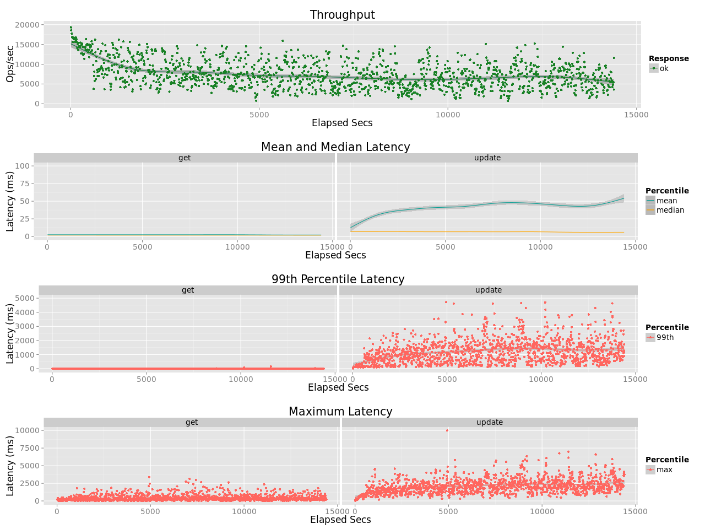

### Mid-Size Object, SSDs, No Sync-On-Write

This test has the following specific characteristics

- An 8KB value size (based on crypto:rand_bytes/1 - so cannot be effectively compressed)
- 100 concurrent basho_bench workers running at 'max'
- i2.2xlarge instances
- allow_mult=false, lww=false
- <b>sync_on_write = off</b>

Comparison charts for this test:

Riak + leveled             |  Riak + eleveldb
:-------------------------:|:-------------------------:
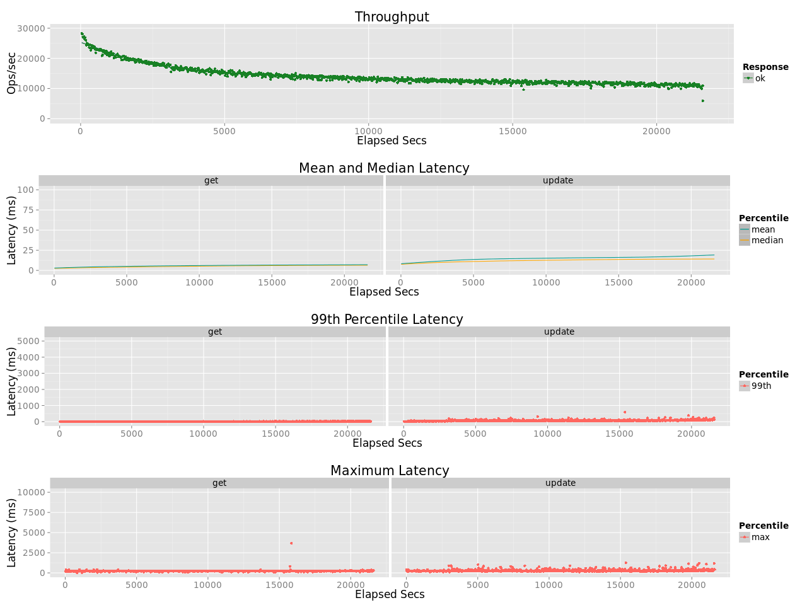  |  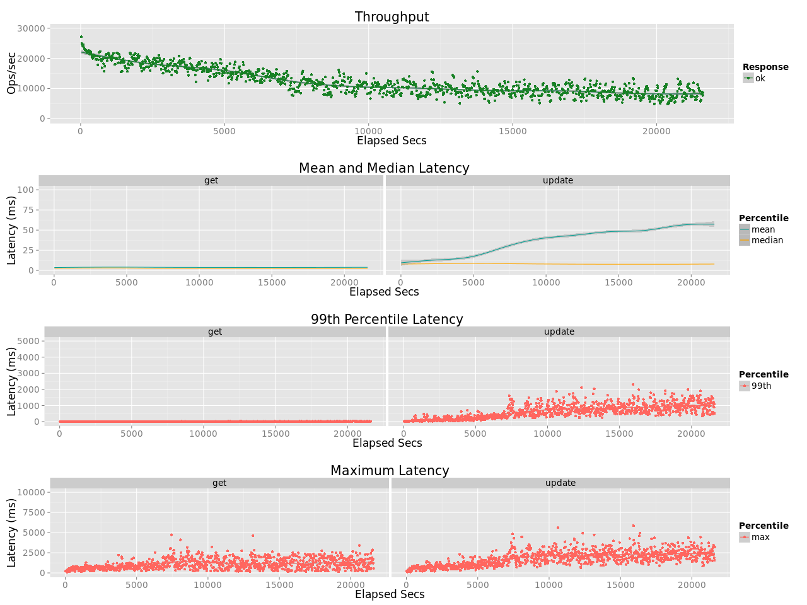

### Mid-Size Object, HDDs, No Sync-On-Write

This test has the following specific characteristics

- An 8KB value size (based on crypto:rand_bytes/1 - so cannot be effectively compressed)
- 50 concurrent basho_bench workers running at 'max'
- <b>d2.2xlarge instances</b>
- allow_mult=false, lww=false
- sync_on_write = off

Comparison charts for this test:

Riak + leveled           |  Riak + eleveldb
:-------------------------:|:-------------------------:
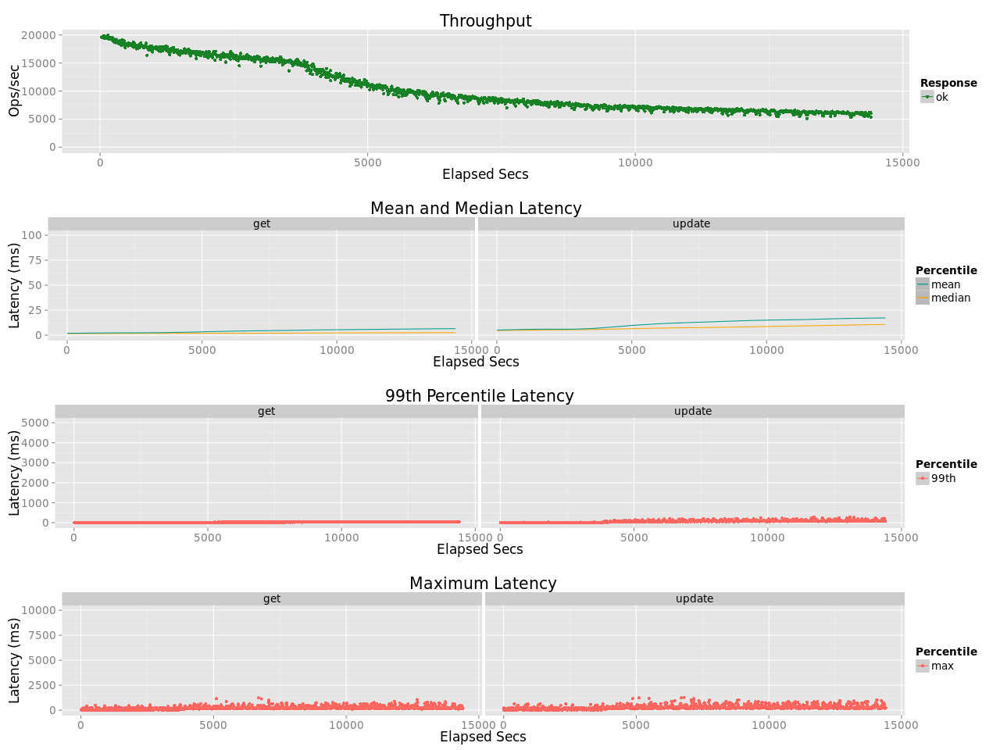  |  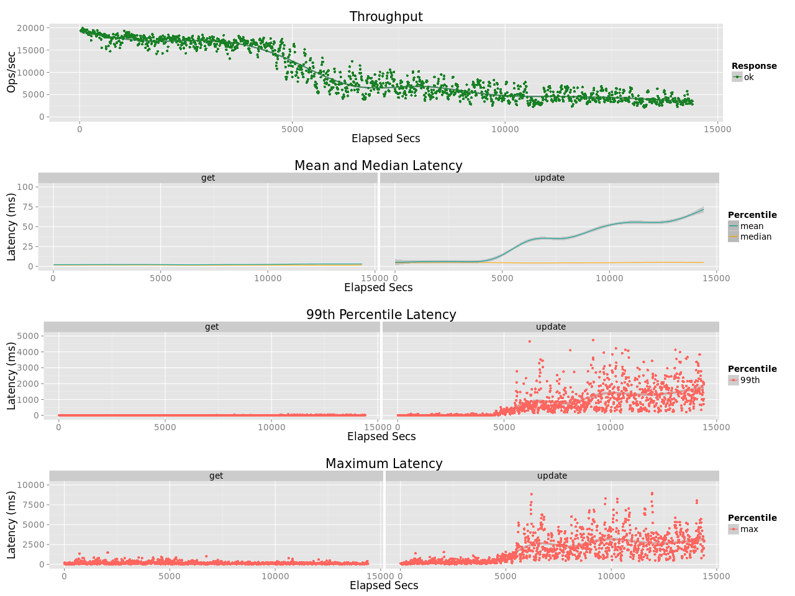

Note that there is a clear inflexion point when throughput starts to drop sharply at about the hour mark into the test.  
This is the stage when the volume of data has begun to exceed the volume supportable in cache, and so disk activity begins to be required for GET operations with increasing frequency.

### Half-Size Object, SSDs, No Sync-On-Write

This test has the following specific characteristics

- A <b>4KB value size</b> (based on crypto:rand_bytes/1 - so cannot be effectively compressed)
- 100 concurrent basho_bench workers running at 'max'
- i2.2xlarge instances
- allow_mult=false, lww=false
- sync_on_write = off

Comparison charts for this test:

Riak + leveled           |  Riak + eleveldb
:-------------------------:|:-------------------------:
  |  

### Double-Size Object, SSDs, No Sync-On-Write

This test has the following specific characteristics

- A <b>16KB value size</b> (based on crypto:rand_bytes/1 - so cannot be effectively compressed)
- 60 concurrent basho_bench workers running at 'max'
- i2.2xlarge instances
- allow_mult=false, lww=false
- sync_on_write = off

Comparison charts for this test:

Riak + leveled           |  Riak + eleveldb
:-------------------------:|:-------------------------:
  |  

### Lies, damned lies etc

The first thing to note about the test is the impact of the pareto distribution and the start from an empty store, on what is actually being tested.  At the start of the test there is a 0% chance of a GET request actually finding an object.  Normally, it will be 3 hours into the test before a GET request will have a 50% chance of finding an object.

Both leveled and leveldb are optimised for finding non-presence through the use of bloom filters, so the comparison is not unduly influenced by this.  However, the workload at the end of the test is both more realistic (in that objects are found), and harder if the previous throughput had been greater (in that more objects are found).  

So it is better to focus on the results at the tail of the tests, as at the tail the results are a more genuine reflection of behaviour against the advertised test parameters.

Test Description                  | Hardware     | Duration |Avg TPS    | TPS Delta (Overall)  | TPS Delta (Last Hour)
:---------------------------------|:-------------|:--------:|----------:|-----------------:|-------------------:
8KB value, 60 workers, sync       | 5 x i2.2x    | 4 hr     | 12,679.91 | <b>+ 70.81%</b>  | <b>+ 63.99%</b>
8KB value, 100 workers, no_sync   | 5 x i2.2x    | 6 hr     | 14,100.19 | <b>+ 16.15%</b>  | <b>+ 35.92%</b>
8KB value, 50 workers, no_sync    | 5 x d2.2x    | 4 hr     | 10,400.29 | <b>+  8.37%</b>  | <b>+ 23.51%</b>
4KB value, 100 workers, no_sync   | 5 x i2.2x    | 6 hr     | 14,993.95 | - 10.44%  | - 4.48%
16KB value, 60 workers, no_sync   | 5 x i2.2x    | 6 hr     | 11,167.44 | <b>+ 80.48%</b>  | <b>+ 113.55%</b>
8KB value, 80workers, no_sync, 2i queries | 5 x i2.2x | 6 hr | 9,855.96 | <b>+ 4.48%</b> | <b>+ 22.36%</b>

Leveled, like bitcask, will defer compaction work until a designated compaction window, and these tests were run outside of that compaction window.  So although the throughput of leveldb is lower, it has no deferred work at the end of the test.  Future testing work is scheduled to examine leveled throughput during a compaction window.  

As a general rule, looking at the resource utilisation during the tests, the following conclusions can be drawn:

- When unconstrained by disk I/O limits, leveldb can achieve a greater throughput rate than leveled.
- During these tests leveldb is frequently constrained by disk I/O limits, and the frequency with which it is constrained increases the longer the test is run for.
- leveled is almost always constrained by CPU, or by the limits imposed by response latency and the number of concurrent workers.
- Write amplification is the primary delta in disk contention between leveldb and leveled - as leveldb is amplifying the writing of values not just keys it is creating a significantly larger 'background noise' of disk activity, and that noise is sufficiently variable that it invokes response time volatility even when r and w values are less than n.
- leveled has substantially lower tail latency, especially on PUTs.
- leveled throughput would be increased by adding concurrent workers, and increasing the available CPU.
- leveldb throughput would be increased by having improved disk i/o.

## Riak Cluster Test - Phase 2 - AAE Rebuild

These tests have been completed using the following static characteristics which are designed to be a balanced comparison between leveled and leveldb:

- 8KB value,
- 100 workers,
- no sync on write,
- 5 x i2.2x nodes,
- 6 hour duration.

This is [a test used in Phase 1](https://github.com/martinsumner/leveled/blob/master/docs/VOLUME.md#mid-size-object-ssds-no-sync-on-write).  Note that since Phase 1 was completed a number of performance improvements have been made in leveled, so that the starting gap between Riak/leveled and Riak/leveldb has widened.

The tests have been run using the new riak_kv_sweeper facility within develop.  This feature is an alternative approach to controlling and scheduling rebuilds, allowing for other work to be scheduled into the same fold.  As the test is focused on hashtree rebuilds, the test was run with:

- active anti-entropy enabled,
- a 3 hour rebuild timer.

The 3-hour rebuild timer is not a recommended configuration, it is an artificial scenario to support testing in a short time window.

In the current Riak develop branch all sweeps use the Mod:fold_objects/4 function in the backend behaviour.  In the testing of Riak/leveled this was changed to allow use of the new Mod:fold_heads/4 function available in the leveled backend (which can be used if the backend supports the fold_heads capability).

In clusters which have fully migrated to Riak 2.2, the hashtrees are built from a hash of the vector clock, not the object - handling the issue of consistent hashing without canonicalisation of riak objects.  This means that hashtrees can be rebuilt without knowledge of the object itself.  However, the purpose of rebuilding the hashtree is to ensure that the hashtree represents the data that is still present in the store, as opposed to the assumed state of the store based on the history of changes.  Rebuilding hashtrees is part of the defence against accidental deletion (e.g. through user error), and data corruption within the store where no read-repair is other wise triggered.  So although leveled can make hashtree rebuilds faster by only folding over the heads, this only answers part of the problem:  a rebuild based on heads only proves deletion/corruption has not occurred in the Ledger, but doesn't rule out the possibility that deletion/corruption has occurred in the Journal.

The fold_heads/4 implementation in leveled partially answers the challenge of Journal deletion or corruption by checking for presence in the Journal as part of the fold.  Presence checking means that the object sequence number is in the Journal manifest, and the hash of the Key & sequence number is the lookup tree for that Journal.  It is expected that corruption of blocks within journal files will be handled as part of the compaction work to be tested in Phase 3.  The branch tested here falls short of CRC checking the object value itself as stored on disk, which would be checked naturally as part of the fold within leveldb.

### Leveled AAE rebuild with journal check

The comparison between leveled and leveldb shows a marked difference in throughput volatility and tail latency (especially with updates).

Riak + leveled           |  Riak + leveldb
:-------------------------:|:-------------------------:
  |  

The differences between the two tests are:

- <strong>47.7%</strong> more requests handled with leveled across the whole test window
- <strong>54.5%</strong> more requests handled with leveled in the last hour of the test
- <b>7</b> more hashtree rebuilds completed in the leveled test

As with other tests the leveled test had a <strong>slower mean GET time</strong> (<b>6.0ms</b> compared to <b>3.7ms</b>) reflecting the extra cycle caused by deferring the GET request until quorum has been reached through HEAD requests.  The leveled test by contrast though had a substantially <strong>more predictable and lower mean UPDATE time</strong> (<b>14.7ms</b> compared to <b>52.4ms</b>).

Throughput in the leveldb test is reduced from a comparative test without active anti-entropy by a significant amount (more than <b>11%</b>), whereas the throughput reduction from enabling/disabling anti-entropy is marginal in leveled comparisons.

### Comparison without journal check

 One surprising result from the AAE comparison is that although the leveled test shows less variation in throughput because of the rebuilds, the actual rebuilds take a roughly equivalent time in both the leveled and leveldb tests:

 Hour          |  Riak + leveled rebuild times |  Riak + leveldb rebuild times
 :-----------:|:-------------------------:|:-------------------------:
 1 | 519.51 | 518.30
 2 | 793.24 | 719.97
 3 | 1,130.36 | 1,111.25
 4 | 1,428.16 | 1,459.03
 5 | 1,677.24 | 1,668.50
 6 | 1,818.63 | 1,859.14

Note that throughput was 50% higher in the Riak + leveled test, so although the times are comparable the database sizes are larger in this test.

To explore this further, the same test was also run but with the leveled backend only folding heads across the Ledger (and not doing any check for presence in the Journal).  In the ledger-only checking version 110 rebuilds were completed in the test as opposed to 80 rebuilds completed without the Journal check.  The time for the checks are halved if the Journal check is removed.

Although the rebuild times are reduced by removing the Journal check, the throughput change for database consumers is negligible (and well within the margin of error between test runs).  So removing the Journal check makes rebuilds faster, but doesn't improve overall database performance for users.

### Comparison with "legacy" rebuild mechanism in leveldb

The sweeper mechanism is a new facility in the riak_kv develop branch, and has a different system of throttles to the direct fold mechanism previously used.  Without sweeper enabled, by default only one concurrent rebuild is allowed per cluster, whereas sweeper restricts to one concurrent rebuild per node.  Sweeper has an additional throttle based on the volume of data passed to control the pace of each sweep.

If the same test is run with a leveldb backend but with the pre-sweeper fold mechanism, then total throughput across the is improved by <b>8.9%</b>.  However, this throughput reduction comes at the cost of a <b>90%</b> reduction in the number of rebuilds completed within the test.

## Riak Cluster Test - Phase 3 - Journal Compaction

When first developing leveled, the issue of compacting the value store was left to one side from a performance perspective, under the assumption that compaction would occur in some out-of-hours window.  Bitcask is configurable in this way, but also manages to do continuous compaction without major performance issues.

For this phase, a new compaction feature was added to allow for "continuous" compaction of the value store (Journal).  This means that each vnode will schedule approximately N compaction attempts through the day, rather than wait for a compaction window to occur.

This was tested with:

- 8KB value,
- 80 workers,
- no sync on write,
- 5 x i2.2x nodes,
- 12 hour duration,
- 200M keys with a pareto distribution (and hence significant value rotation in the most commonly accessed keys).

With 10 compaction events per day, after the 12 hour test 155GB per node had been compacted out of the value store during the test.  In the 12 hours following the test, a further 125GB was compacted - to the point there was rough equivalence in node volumes between the closing state of the leveled test and the closing state of the leveldb test.

As before, the Riak + leveled test had substantially lower tail latency, and achieved higher (and more consistent) throughput.  There was an increased volatility in throughput when compared to non-compacting tests, but the volatility is still negligible when compared with leveldb tests.

Riak + leveled           |  Riak + leveldb
:-------------------------:|:-------------------------:
  |  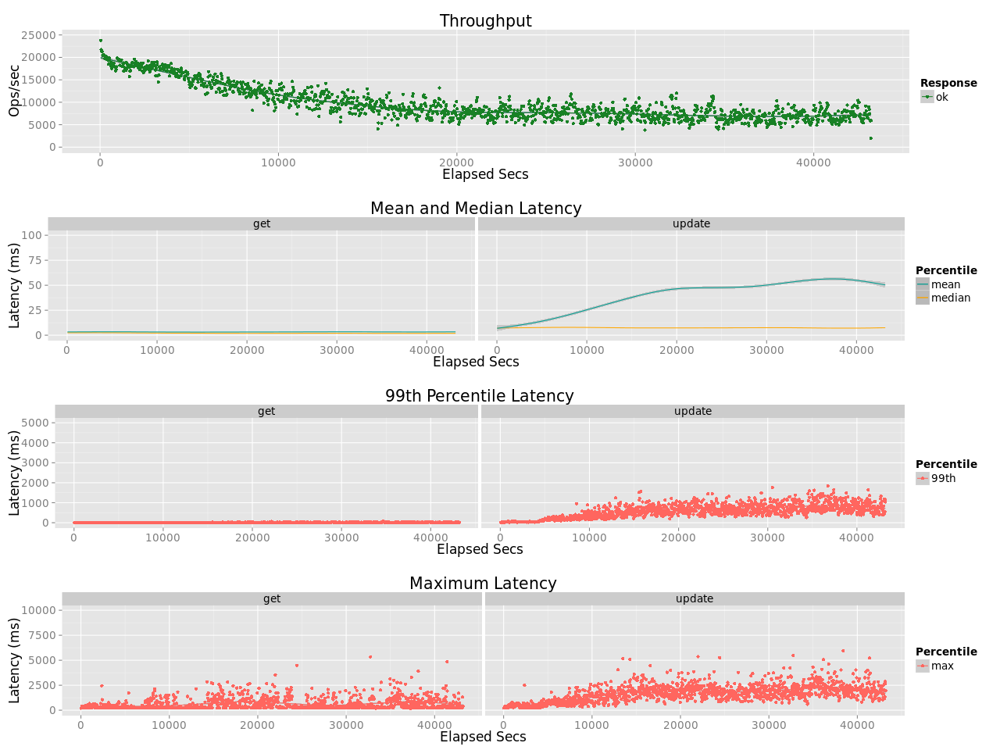

The throughput difference by hour of the test was:

Test Hour| Throughput | leveldb Comparison
:-------------------------|------------:|------------:
Hour 1 | 20,692.02 | 112.73%
Hour 2 | 16,147.89 | 106.37%
Hour 3 | 14,190.78 | 115.78%
Hour 4 | 12,740.58 | 123.36%
Hour 5 | 11,939.17 | 137.70%
Hour 6 | 11,549.50 | 144.42%
Hour 7 | 10,948.01 | 142.05%
Hour 8 | 10,625.46 | 138.90%
Hour 9 | 10,119.73 | 137.53%
Hour 10 | 9,965.14 | 143.52%
Hour 11 | 10,112.84 | 149.13%
Hour 12 | 10,266.02 | 144.63%

This is the first time a test of this duration has been run, and there does appear to be a trend of Riak/leveled throughput tending towards a stable volume, rather than an ongoing decline in throughput as the test progresses.

## Riak Cluster Test - Phase 4 - 2i

Testing with secondary indexes provides some new challenges:

- Including index entries on updates will accelerate the flow of merges in the merge tree, as each update into the merge tree is now multiple changes;
- The 2i query needs an efficient snapshot to be taken of the store, and multiple such snapshots to exist in parallel;
- The coverage nature of the query means that the query operation is now as slow as the slowest of the vnodes (out of 22 nodes with a ring size of 64), rather than being as slow as the second slowest of three vnodes.  Coverage queries are reactive to local resource pressure, whereas standard GET flows can work around such pressure.

The secondary index test was built on a test which sent

- 100 GET requests;
- 10 update requests (i.e. GET then PUT) for 8KB fixed sized objects;
- 10 update requests (i.e. GET then PUT) for 8KB fixed sized objects with four index entries each (leading to 4 index changes for a new request, 8 index changes for an update request);
- 1 2i range query on the "date of birth" index with return_terms enabled;
- 1 2i range query on the "postcode index" with return_terms enabled.

The query load is relatively light compared to GET/PUT load in-line with Basho recommendations (decline from 350 queries per second to 120 queries per second through the test).  The queries
return o(1000) results maximum towards the tail of the test and o(1) results at the start of the test.

Further details on the implementation of the secondary indexes for volume tests can be found in the [driver file](https://github.com/martinsumner/basho_bench/blob/mas-nhsload/src/basho_bench_driver_riakc_pb.erl) for the test.

Riak + leveled           |  Riak + leveldb
:-------------------------:|:-------------------------:
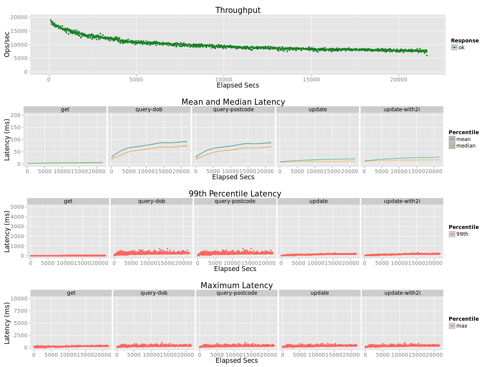  |  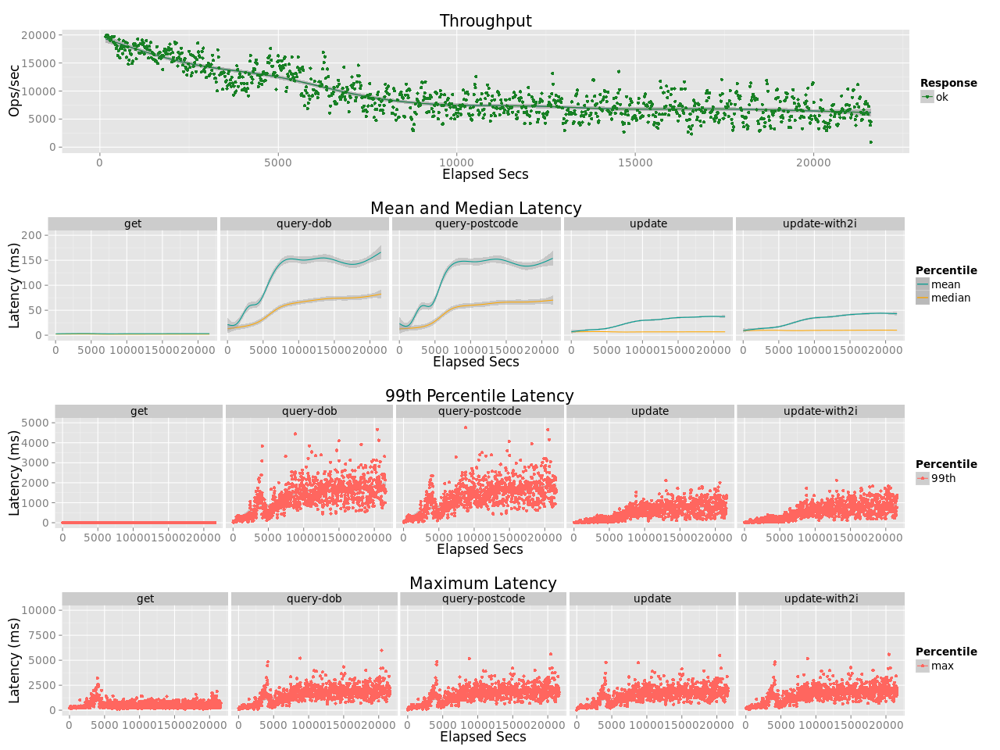

The results are similar as to previous tests.  Although the test is on infrastructure with optimised disk throughput (and with no flushing to disk on write from Riak to minimise direct pressure from Riak), when running the tests with leveldb disk busyness rapidly becomes a constraining factor - and the reaction to that is volatility in throughput.  Riak combined with leveldb is capable in short bursts of greater throughput than Riak + leveled, however when throttled within the cluster by a node or nodes with busy disks, the reaction is extreme.

The average throughputs hour by hour are:

Hour      |Riak + leveled             |  Riak + leveldb           | Delta
:--------|-------------------------:|-------------------------:|--------
1 | 14,465.64 | 16,235.83 | - 10.90%
2 | 10,600.16 | 11,813.14 | - 10.27%
3 |  8,605.89 |  7,895.84 | <b>+ 18.63%</b>
4 |  9,366,19 |  7,225.25 | <b>+ 19.11%</b>
5 |  8,180.88 |  6,826.37 | <b>+ 19.84%</b>
6 |  7,916.19 |  6,469.73 | <b>+ 22.36%</b>

The point of inflection when leveled-backed Riak begins to out-perform leveledb-backed Riak is related to the total size of the database going beyond the size of the in-memory cache.  The need to go to disk for reads as well as writes amplifies the disk busyness problem associated with write amplification.

As before, increasing the available CPU will increase the potential throughput of a leveled-backed cluster.  Increasing the disk IOPS rate will increase the potential throughput of a leveldb-backed cluster.  Increasing object sizes, will extend the throughput advantage of leveled and decreasing sizes will improve the performance of leveldb.  Increasing the size of the database relative to cache may increase the throughput advantage of leveled - but this may not hold true for all work profiles (for example those frequently accessing recently updated objects).

In the 2i query test there is the same significant reduction in tail latency when comparing leveled with leveldb.  For the 2i queries there is also a significant reduction in mean latency - a <b> 57.96%</b> reduction over the course of the test.  However this reduction is not a sign that leveled can resolve 2i queries faster than leveldb - it is related to the problem of tail latency.  The minimum response time for a 2i query in leveldb drifts from 4ms to 14ms as the test progresses - whereas the minimum response time for Riak and leveled fluctuates from 5ms through to 20ms at the end of the test.  Outside of resource pressure leveldb will give a faster response - but resource pressure is much more likely with leveldb.

## Riak Cluster Test - Phase 5 - Bitcask compare

For larger objects, it is interesting to compare performance with between Bitcask and leveled.  At the start of a pure push test it is not possible for leveled to operate at the same rate as bitcask - as bitcask is finding/updating pointer s through a NIF'd memory operation in C (whereas leveled needs to has two levels of indirect pointers which are being lazily persisted to disk).

However, as the test progresses, there should be an advantage in that leveled is not needing to read each object from disk N times on both PUT and GET - so as the scope of the database creeps beyond that covered by the page cache, and as the frequency of disk reads starts to create an I/O bottlneck then leveled throughput will become more competitive.

Here is a side-by-side on a standard Phase 1 test on i2, without sync, and with 60 threads and 16KB objects.

Riak + leveled           |  Riak + bitcask
:-------------------------:|:-------------------------:
  |  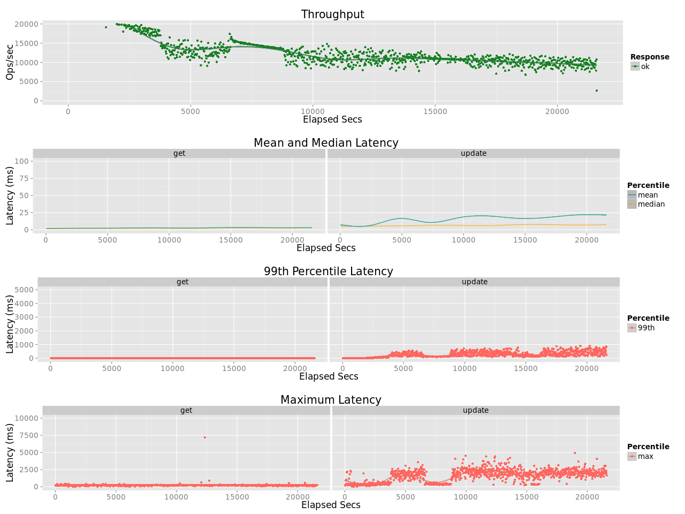

In the first hour of the test, bitcask throughput is <b>39.13%</b> greater than leveled.  Over the whole test, the bitcask-backed cluster achieves <b>16.48%</b> more throughput than leveled, but in the last hour this advantage is just <b>0.34%</b>.

The results for bitcask look a bit weird and lumpy though, so perhaps there's something else going on here that's contributing to the gap closing.

## Riak Cluster Test - Phase 6 - NHS Hardware compare

Phase 1 to 5 volume testing to this stage has been performed in a cloud environment, the Phase 6 test though was run on physical servers loaned from the NHS environment.  These servers have the following characteristics:

- 12 (fairly slow) CPU cores (24 CPU threads);
- 96GB DRAM;
- A RAID 10 array of 6 disks - all using traditional low-cost spinning disk hardware;
- RAID managed by a RAID controller with a Flash-Backed Write Cache;
- 8 nodes in the cluster;
- Gigabit networking.

The test is based on a special blended load developed to mimic the NHS use case., with the following characteristics:

- Most objects are large (10KB) but heavily used objects are potentially up to 5 times larger than this.  
- Most objects are compressible, but a proportion of traffic is to write-once documents which cannot be compressed.
- Each write must be flushed to disk (this is still performant because of the FBWC);
- The majority of traffic is GETs;
- There are also 2i queries which represent about 2-3% of overall volume, including some use of regular expression in 2i queries;
- Most of the traffic (for non write-once objects) sits within a keyspace of about 100M, with a rough pareto distribution (80% of the load against 20% of the records).

The test config can be found [here](https://github.com/martinsumner/basho_bench/blob/mas-nhsload/examples/riakc_nhs.config).

The comparison here is between Riak 2.2.3 with leveldb backend, compared to Riak 2.2.3 with leveled backend and related enhancements (in particular using n HEADS and 1 GET for GET requests).  Active Anti-Entropy was enabled for both tests.

In the straight time comparisons used in early phases, the picture doesn't reflect the issue of accumulation of load within the store.  The more data in the store, the harder all requests become to resolve - so rather than compare throughput over time, it is better to compare throughput with the aggregate level of operations so far.

This chart provides the comparison from this test:

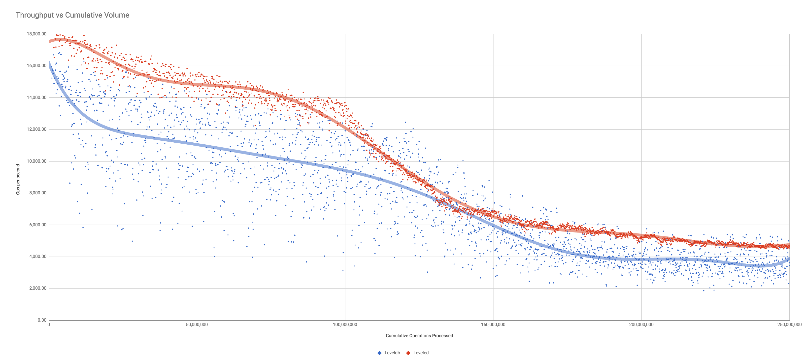

The pattern is for the enhanced Riak with leveled to both consistently achieve higher average operations per second throughput, but for that throughput to be more consistent (i.e. more tightly clustered around the trendline).  At the backend of the test (when data volumes become more realistic), the difference in the trendlines is about 25%.

Although the throughput achieved is better than with vanilla Riak/leveldb, the mean GET time is noticeably slower:

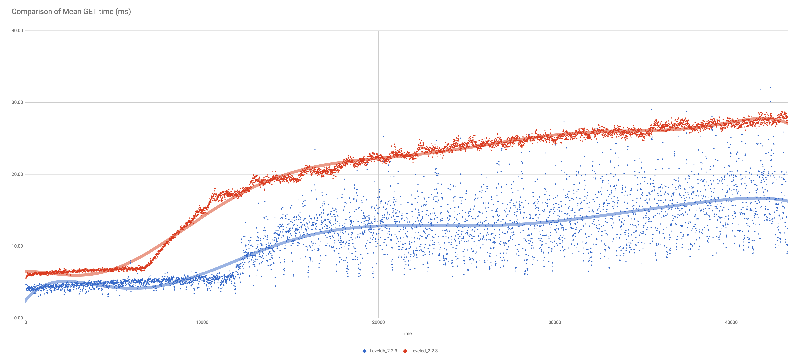

It is assumed that the difference in MEAN GET time is directly related to:

- The extra round trip from HEAD to GET request as a result of the changed GET FSM behaviour;
- The additional overhead during the GET request of looking up the value in the Journal as well as the reference in the LSM tree.

The Mean GET time may be nearly double, but the (slower) GET time is much more predictable as can be seen from the clustering around the trend line in the chart.  This is also show from the 99th percentile chart - where the 99th percentile GET time trendline is consistent between leveled and leveldb, but the variance in that time over time is not consistent:

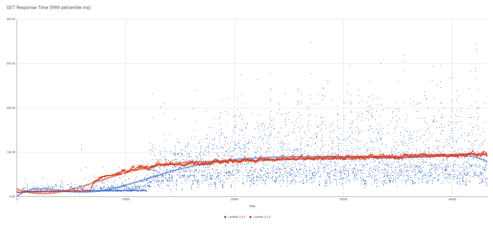

It is assumed that the volatility difference is related to vnode queues, which can normally be worked around in GET requests using r=2/n=3, except when more than one vnode in the preflist has queues.  PUT requests are much more susceptible to vnode queues due to the random choosing of a coordinator, and the PUT being directly delayed by queues at that coordinator.

Looking at the 99th percentile times for PUTs, Riak/leveled is an order of magnitude better than Riak/leveldb both in terms of trend and standard deviation from the trend.

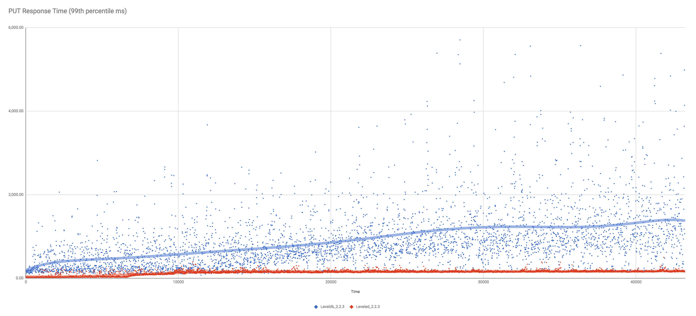

Likewise for 2i queries (which are particularly susceptible to vnode queues), there is now an order of magnitude improvement in the mean response time:

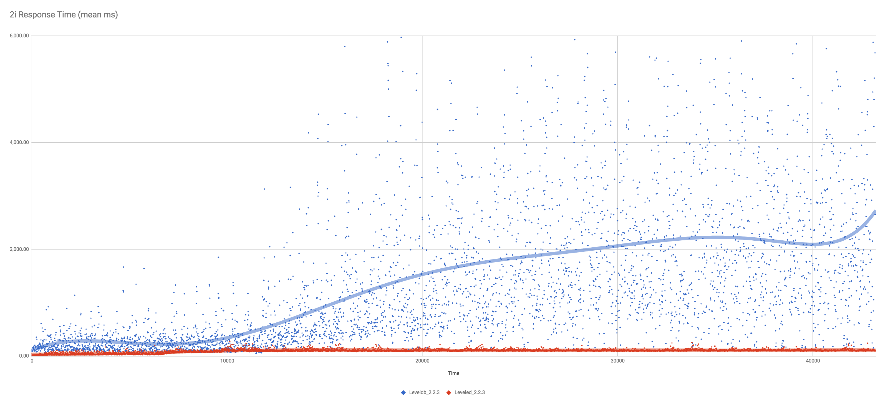

The stability of response times is not as of result of a lack of resource pressure.  Once the volume of data on disk surpassed that which could be covered by page cache, the disk busyness rapidly increased to 100%:

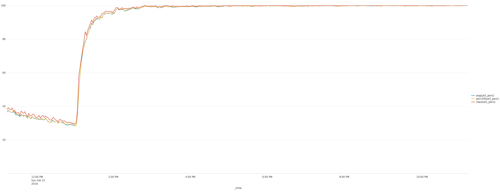

CPU utilisation was also generally high (and notably higher than in the Riak/leveldb test), running at between 50 and 60% throughout the test:

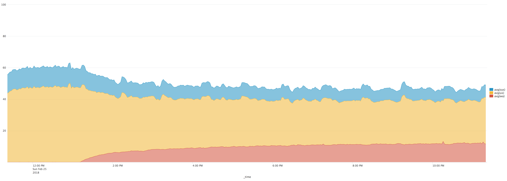

All this has implications for future backend choices, but also for the nature of the GET and PUT FSMs.  The most positive non-functional characteristic is the external response time stability in face of internal resource pressure.  What isn't clear is to the extent that this is delivered simply through a backend change, or by the change in the nature of the FSM which naturally diverts load away from vnodes with longer queues (e.g. delays) evening out the load in face of localised pressures.

It will be interesting to see in the case of both leveldb and leveled backends the potential improvements which may arise from the use of [vnode_proxy soft overload checks and a switch to 1 GET, n-1 HEADS](https://github.com/basho/riak_kv/issues/1661).

### Extending to 24 hours

Running the test over 24 hours provides this comparison between 200M and 400M accumulated operations:

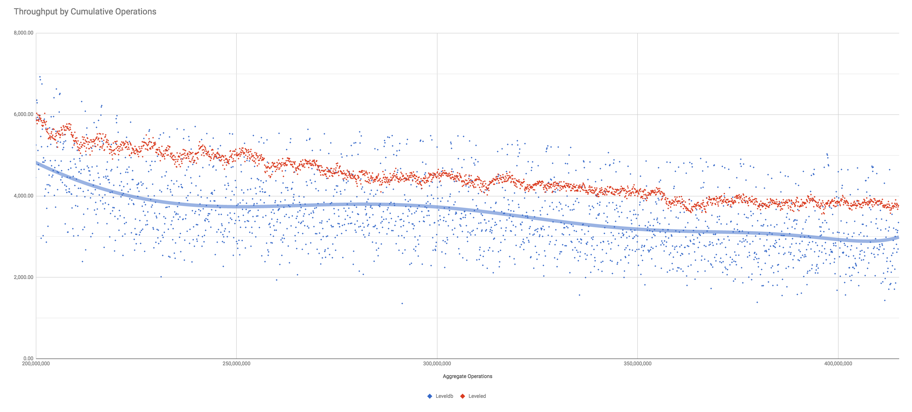

The trendline has been removed from the Leveled graph as the trend is obvious.  The difference between the trends for the two backends is consistently 30%-35% throughout the extended portion.

These graphs show side-by-side comparisons of disk utilisation (median, mean and max), and read_await and write_await times - with the Leveled test in the first 24 hours, and the leveldb test in the second 24 hour period.

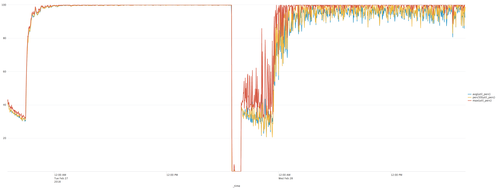

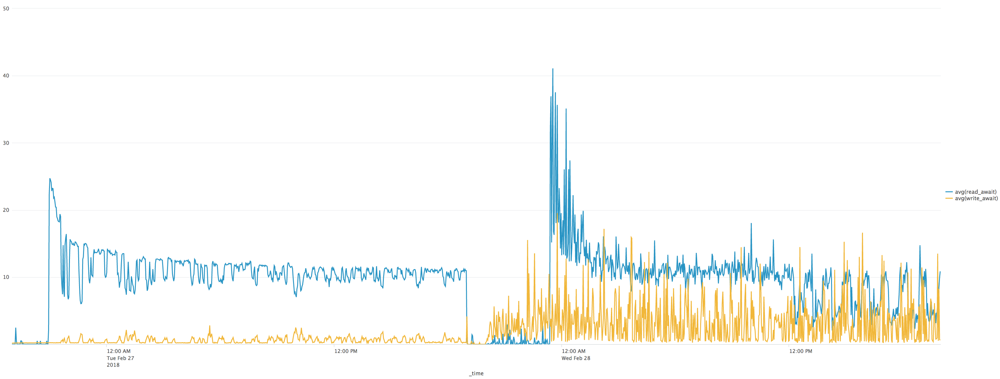

Both tests become constrained by disk, but the Leveled test pushes the disk in a more consistent manner producing more predictable results.

The other notable factor in running the test for 24 hours was that the mean 2i response time continued to rise in the Leveldb test, but not the leveled test.  By the 24th hour of the test the Leveldb test had a mean 2i response time of over 3s, whereas the mean response time in the Leveled remained constant at around 120ms.
